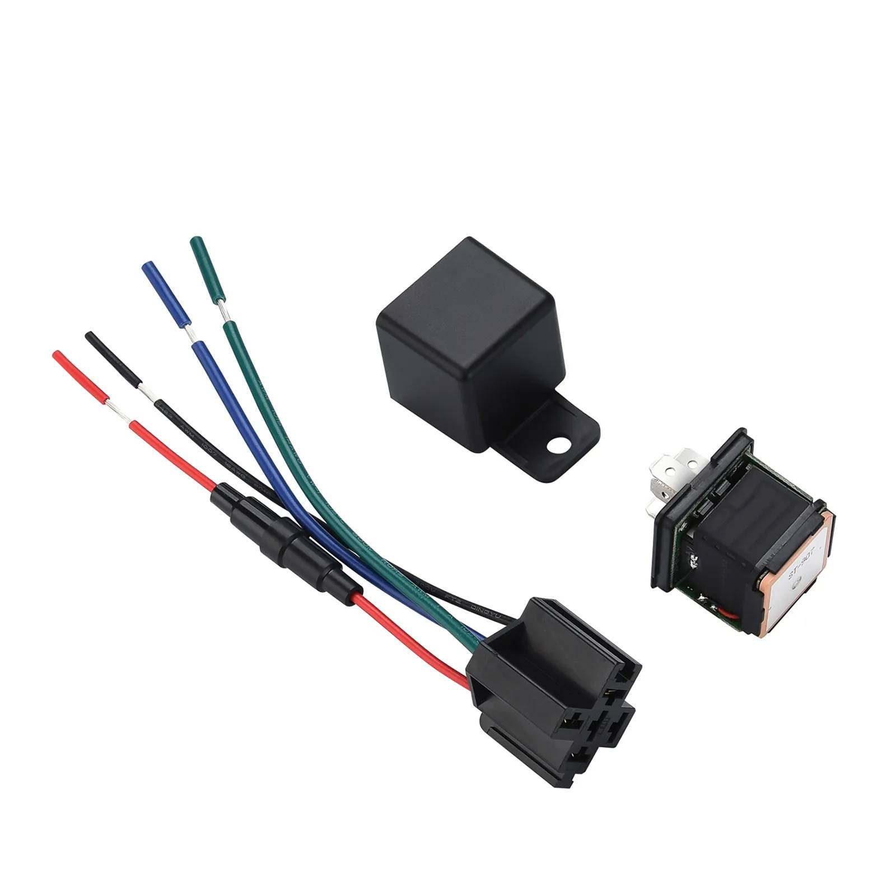

# SinoTrack - ST-907L

The SinoTrack Relay ST-907L is a compact GPS tracker designed for motorcycles and cars that require dependable real-time tracking and remote vehicle control. It combines dual GNSS positioning, a high sensitivity SIMCOM 7670SA module, and support for both 4G LTE and 2G GSM networks to provide consistent location fixes, faster assisted start times, and protections against common signal spoofing methods. The form factor and operating voltage range make it suitable for a variety of small vehicle installations while retaining core anti-theft and telemetry features.

As a Plaspy compatible device, the ST-907L can stream location and event data into Plaspy for centralized monitoring and fleet oversight. When integrated with Plaspy, this tracker supplies live map views, route history, geofence alerts, remote immobilization controls, and the basic telemetry needed to improve uptime and reduce theft risk. Its compact design and backup power capabilities make it a practical choice for organisations and individuals looking to add discreet, reliable tracking to their Plaspy deployments.

## Key Highlights

- Plaspy compatible for straightforward integration into real-time tracking dashboards and fleet workflows.
- Dual GNSS positioning with a SIMCOM 7670SA module to support stable location fixes and assisted acquisition.
- Support for 4G LTE and 2G GSM networks to help maintain connectivity across varied coverage areas.
- Small, discreet form factor suited to motorcycles, cars, and light commercial vehicles with a wide operating voltage range.
- Built in backup battery that preserves alerts and location reporting during primary power loss for anti-theft resilience.
- Comprehensive alarm suite including vibration or displacement detection, power loss, low battery, and overspeed alerts.
- Remote immobilizer support and mileage reporting to help with loss prevention and basic fleet analytics.

## How It Works with Plaspy

When connected to Plaspy, the ST-907L delivers its GNSS fixes and event signals to a centralized Plaspy account so operations and security teams can monitor assets in real time, configure alerts, and review historical activity. Plaspy consumes the device’s positional and event data to present actionable views for dispatch, security response, and fleet analysis.

- Live map tracking and periodic position updates for real time visibility across the fleet.
- Geofence configuration with notifications for entry and exit events to enforce perimeter policies.
- Forwarding of vibration, power off, low battery, and overspeed alarms to Plaspy for immediate notification and logging.
- Remote immobilizer control exposed through Plaspy to support rapid anti-theft response.
- Route history and mileage records available in Plaspy for basic utilization reporting and operational review.
- Plaspy dashboards aggregate the tracker telemetry to aid decision making and operational oversight.

## Typical Use Cases

- Fleet management for small vehicles where compact hardware and mileage reporting support daily operations.
- Anti theft protection using backup power and remote immobilization to preserve tracking and enable recovery actions.
- Motorcycle and scooter tracking where a discreet unit and broad voltage tolerance are important.
- Delivery and service vehicle oversight with geofence and route history to verify stops and optimize routes.
- Mixed fleet monitoring across cars and light commercial vehicles using a single device model for simplicity.

## Why Choose This Tracker with Plaspy

The ST-907L offers a practical balance of compact hardware, resilient GNSS performance, and essential remote control features that fit both single vehicle security and multi vehicle fleet use. Its compatibility with Plaspy means tracking data and event alerts are available within a centralized platform for monitoring, alerting, and retrospective analysis without requiring complex additional systems.

If you are evaluating devices for a Plaspy deployment, the ST-907L is worth considering when you need discreet installation, reliable positioning, and remote immobilization capabilities combined with a small physical footprint. Learn more about Plaspy on the main website https://www.plaspy.com and verify current specifications, availability, and manufacturer details on the official SinoTrack site https://www.sinotrackgps.com/ as product details can change over time.
