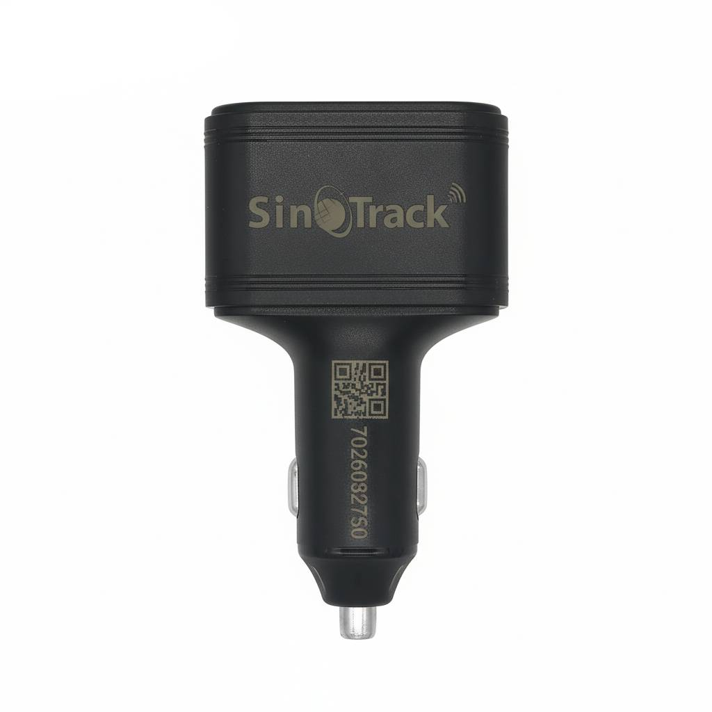

# SinoTrack - ST-909L

The SinoTrack ST-909L is a compact 4G GPS tracker integrated into an aluminium car charger housing. Designed for straightforward in vehicle placement and discreet concealment, the unit combines continuous location reporting with USB charging outputs so it can serve both as a tracking device and a driver convenience accessory. The ST-909L supports SMS configuration to set server and network parameters, and provides common tracking features such as geofence and overspeed alerts along with route history.

As a Plaspy compatible device, the ST-909L can be pointed at a custom server IP and APN via SMS so it reports directly to your Plaspy account for real time monitoring. That configurability makes the device suitable for operators who want centralized fleet visibility, alarm forwarding, and historical route playback inside Plaspy while retaining the convenience of a plug in car charger form factor.

## Key Highlights

- Plaspy compatible by design with SMS configurable server IP and APN for direct reporting to Plaspy.
- Compact aluminium car charger form factor with Type A and Type C fast charging outputs for driver convenience.
- Continuous real time tracking plus history playback for route review and operational analysis.
- Professional alarm support including geofence and overspeed alerts for timely incident response.
- SMS fallback tracking with Google Maps link support when data connectivity is limited.
- Fleet friendly management allowing multiple devices to be consolidated under one account.

## How It Works with Plaspy

Once the ST-909L is configured to point at your Plaspy server and APN via SMS commands, it streams location updates and alarm events into Plaspy so they appear on live maps, in alerts, and in historical reports. Integration is based on the device sending its telemetry to a configurable server address enabling Plaspy to provide centralized visibility and fleet oversight.

- Real time location updates and status reports flow into Plaspy after SMS configuration of server IP and APN.
- Alarm forwarding for geofence breaches, overspeed events and shock style alerts delivered to Plaspy for operator notification.
- SMS tracking with map links serves as a fallback method for recovering location when data paths are unavailable.
- Route history and event logs can be reviewed in Plaspy when the device reports to your Plaspy account.
- Centralized device management in Plaspy consolidates telemetry, alerts and reporting for multi unit fleets.

## Typical Use Cases

- Fleet tracking and dispatch visibility for businesses that need real time position and route history.
- Anti theft workflows where geofence and shock alerts trigger operator follow up.
- Driver safety and compliance monitoring using overspeed alerts and trip playback for incident review.
- Discreet vehicle tracking when a low profile charger form factor is preferred for concealment.
- SMS fallback recovery in low coverage areas to obtain last known locations via message links.

## Why Choose This Tracker with Plaspy

The ST-909L brings together practical in vehicle utility and configurable telemetry in a single compact device. Its SMS based server and APN configuration mechanism makes integration with Plaspy straightforward for teams that want to centralize tracking, alarms and historical data without bespoke provisioning tools. For fleet operators the combination of live updates, alarm reporting and history playback in Plaspy supports operational oversight, dispatch decisions and incident analysis.

Because product details such as regional band support, available features and regulatory requirements can vary, confirm network compatibility, SIM selection and any local registration rules before deployment. The ST-909L does not include a SIM card, so obtaining a suitable service and verifying APN settings is part of a typical setup workflow.

To learn more about Plaspy and how it can manage devices like the SinoTrack ST-909L visit https://www.plaspy.com. Product specifications, availability and manufacturer details can change over time, so please verify current technical information on the official SinoTrack website https://www.sinotrackgps.com/.
