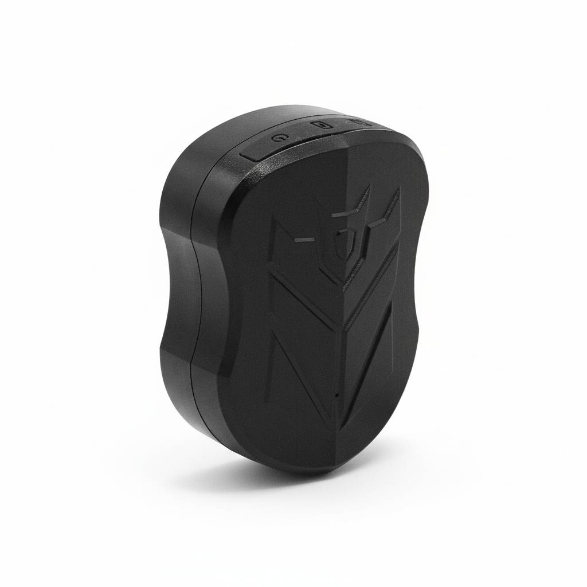

# SinoTrack - ST-915

The ST-915 is a rugged, waterproof GPS/GSM/GPRS locator designed for long autonomous operation and reliable outdoor tracking. Built around a UBLOX UBX-G7020 GNSS module and a quad band 2G modem, the ST-915 delivers accurate position fixes and extended standby from a large Li ion battery. The unit is supplied without a SIM so you can choose a local operator and data plan that best fits fleet management, anti theft and remote monitoring needs. Configuration is accomplished via SMS commands to set APN and server address, making it straightforward to integrate with third party tracking platforms.

This model is compatible with Plaspy and can be pointed to Plaspy server endpoints using the device SMS configuration. Once configured, the ST-915 can forward real time location updates, history points and basic telemetry messages to Plaspy for fleet visibility and operational oversight. Its combination of durable construction, long standby capability and simple SMS based setup makes the ST-915 a practical option for organizations that want control over carrier choice while using Plaspy as their tracking and reporting platform.

## Key Highlights

- Plaspy compatible by SMS based server IP and port configuration for direct reporting to Plaspy.
- Very long standby from a large Li ion battery for extended off grid operation.
- Rugged waterproof enclosure suitable for outdoor assets and exposed vehicle mounting.
- UBLOX UBX G7020 GNSS module for accurate position fixes and reliable satellite performance.
- Quad band 2G GSM/GPRS connectivity for broad carrier compatibility where 2G is available.
- Simple SMS based APN and server setup so deployments can be completed without special tools.
- Compact, lightweight form factor for discreet mounting on vehicles and portable assets.

## How It Works with Plaspy

The ST-915 transmits GNSS positions and telemetry over GSM/GPRS to a configured server IP and port. By using the device SMS commands to set APN and the target server, integrators and fleet operators can point the unit at Plaspy so that live updates, history logs and status messages arrive in the Plaspy platform for monitoring and reporting.

- Real time location and basic telemetry delivered to Plaspy after pointing the device to Plaspy endpoints.
- History playback and route logs available within Plaspy for audit trails and operational review.
- Fast deployment using SMS based APN and server configuration without additional provisioning tools.
- Integration with Plaspy fleet management features for vehicle and asset visibility once reporting is active.
- Option to retain the vendor SinoTrack platform as a backup while using Plaspy as the primary tracker server.

## Typical Use Cases

- Fleet management for small and medium vehicle fleets where long battery life reduces maintenance.
- Asset tracking for trailers, containers and outdoor equipment that need waterproof hardware.
- Motorcycle and car tracking for theft recovery and discreet location monitoring with long standby.
- Remote site monitoring where devices must operate autonomously for extended periods.
- Route auditing and history playback for compliance and operational analysis.

## Why Choose This Tracker with Plaspy

The ST-915 pairs practical hardware design with straightforward integration to Plaspy, making it a sensible choice when long unattended operation and reliable outdoor performance are priorities. Its SMS based configuration and support for a user supplied SIM allow organizations to control carrier selection and data plans while using Plaspy for centralized tracking, reporting and fleet oversight. The device focuses on core GNSS location and GSM/GPRS reporting, which keeps deployment and ongoing management simple for many tracking scenarios.

To learn more about Plaspy and how it can manage devices like the ST-915 visit https://www.plaspy.com. Product specifications, availability and manufacturer details can change over time, so please verify current specifications and any feature requirements with the official manufacturer documentation at https://www.sinotrackgps.com/.
