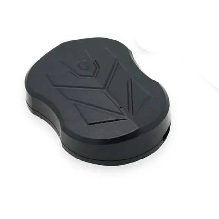

# SinoTrack - ST-915L

The SinoTrack ST-915L is a heavy duty GPS tracker engineered for long term, low maintenance tracking of vehicles and mobile assets. It is supplied in a waterproof magnetic enclosure for discreet external mounting on cars, trucks, motorcycles and other equipment. With a built in 3.7V 10000 mAh rechargeable battery and LTE Cat 1 plus 2G connectivity, the ST-915L is designed to provide reliable real time position reporting and extended standby operation for fleet and asset use.

This model is Plaspy compatible when configured to report to a Plaspy server, so it can be integrated into Plaspy based tracking workflows. The ST-915L supports updating device server address and APN settings via SMS, allowing you to point reporting to your Plaspy instance for live tracking, history, and operational monitoring without specialized provisioning steps.

## Key Highlights

- Plaspy compatible via SMS configurable server address and APN for direct reporting to a Plaspy server.
- Long standby capacity with a 3.7V 10000 mAh rechargeable battery for extended periods between charges.
- Rugged waterproof magnetic enclosure suitable for covert external mounting on a range of vehicles and assets.
- Reliable GNSS positioning with UBLOX UBX G7020 offering typical positional accuracy around 5 meters.
- Dual cellular connectivity with LTE Cat 1 and legacy 2G fallback to maintain connectivity across network conditions.
- Compact and lightweight form factor for flexible placement on cars, trucks, motorcycles and portable assets.
- Manufacturer provided web and mobile platform for initial testing and live tracking without subscription fees.

## How It Works with Plaspy

Integrating the ST-915L with Plaspy is straightforward because the device can be directed to send its reports to a custom server address and APN using SMS configuration commands. Once pointed at your Plaspy server, the tracker will deliver position and status packets over the cellular link for processing within Plaspy.

- Real time location and telemetry updates sent over LTE Cat 1 or 2G to the configured Plaspy server.
- Accurate and timely position fixes that improve visibility in fleet monitoring and operational decision making.
- Battery and device status reporting available to Plaspy so managers can track device health and standby expectations.
- Historical position data and events imported into Plaspy for route playback, reporting and analysis.
- Server and APN settings configurable via SMS to redirect reporting to Plaspy without physical access to the device.

## Typical Use Cases

- Fleet management and long haul logistics where continuous tracking and long standby are needed.
- Anti theft monitoring for cars, taxis and motorcycles using discreet magnetic mounting for covert placement.
- Seasonal or infrequently used vehicles such as scooters and stored equipment that benefit from long term battery life.
- Remote asset tracking for trailers, construction items and valuables that require waterproof, maintenance free devices.
- Telemetry review and historical analysis within Plaspy for trip review, geofence events and battery trends.

## Why Choose This Tracker with Plaspy

The ST-915L pairs rugged hardware and extended battery life with flexible server configuration, making it a practical choice for organizations that want to add durable devices to a Plaspy deployment. Its GNSS performance and modern cellular connectivity help deliver the location fidelity and uptime many fleets and asset managers require, while SMS based server configuration reduces the need for specialized provisioning.

For teams evaluating GPS devices for Plaspy, the ST-915L is worth considering when covert mounting, long standby and straightforward redirection of reporting to a custom server are priorities. To learn more about Plaspy and how this device can be integrated into your tracking workflows visit https://www.plaspy.com. Product specifications, availability and manufacturer details can change over time, so please verify current specifications on the official SinoTrack website https://www.sinotrackgps.com/.
