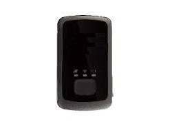

# SkyMobile - SM-8570

The SM-8570 from SkyMobile is a portable GPS locator designed for a broad range of tracking applications. It is presented as a versatile tracker for motorcycles, containers, merchandise, people, and other valuable assets. The device highlights strong GPS reception sensitivity for fast time to first fix and reliable positioning, and includes features such as a UBLOX GPS chipset, an integrated GSM GPS antenna, a 3D motion sensor, a tactile function key, and a water resistant enclosure. The SM-8570 can transmit location information to a real time server or via SMS and operates on quad band GSM for wide communication coverage.

As a Plaspy compatible device, the SM-8570 can integrate into Plaspy's fleet and asset management platform to provide continuous location visibility and operational oversight. Its support for the @Track communications protocol and SMS reporting makes it straightforward to route device data into Plaspy for monitoring, alerts, and reporting. With long standby times and motion based power management, the SM-8570 is suitable for deployments that require extended tracking intervals and reliable position updates for assets managed through Plaspy.

## Key Highlights

- Versatile portable tracker suited for motorcycles, containers, merchandise, people, and general assets
- High GPS sensitivity for fast initial fixes and improved location reliability
- Quad band GSM communications enabling broad cellular coverage for reporting
- Water resistant design for outdoor and mixed environment use
- Built in 3D motion sensor for motion detection and power management
- Long standby performance with extended operation using external battery options
- Supports @Track protocol and SMS reporting for easy integration with platforms like Plaspy

## How It Works with Plaspy

Plaspy can ingest location and status messages sent by the SM-8570, making live tracking and historical reporting available to fleet managers and operations teams. Because the device can report over standard messaging channels and uses a common tracking protocol, Plaspy can be configured to receive and normalize the SM-8570 data for visualization and alerting.

- Receive real time location updates in Plaspy for live map visibility and route monitoring
- Configure movement based alerts and motion detection events to trigger notifications
- Use historical position data for playback, trip reconstruction, and reporting
- Generate scheduled or on demand reports for fleet utilization and asset activity
- Centralize SMS or server forwarded messages from the device into Plaspy dashboards
- Allow system integrators to map device fields to Plaspy events and custom reports

## Typical Use Cases

- Motorcycle fleet tracking and recovery monitoring
- Container and cargo tracking during transport and storage
- Monitoring high value merchandise in transit or at temporary locations
- Personal safety and lone worker location tracking where portability matters
- Long duration asset tracking where extended standby is required

## Why Choose This Tracker with Plaspy

The SM-8570 pairs practical hardware features with reporting flexibility, making it a reasonable choice for organizations that need portable, sensitive GPS performance together with long standby operation. Its integrated motion sensor and strong GPS reception help conserve power while maintaining useful position updates, and the water resistant housing adds resilience for field use. Those characteristics align well with Plaspy's strengths in real time monitoring, alerting, and fleet level reporting.

If you are evaluating devices for Plaspy, the SM-8570 offers a balance of portability, reliable reception, and communications flexibility that can suit many asset tracking scenarios. Learn more about Plaspy and how compatible devices are supported on the main website https://www.plaspy.com. Product specifications, availability, and manufacturer details can change over time; please verify current specifications with official SkyMobile documentation at http://www.skymobile.com.co.
