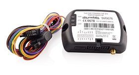

# SkyMobile - SM-9570

The SkyMobile SM-9570 is a versatile GPS locator designed primarily for vehicle and truck tracking applications. It emphasizes high GPS reception sensitivity through an integrated UBLOX chipset and supports quad band cellular operation on 850/900/1800/1900 frequencies. The device is built to periodically report its position to a server or external system, offers multiple input and output interfaces for monitoring and control of external devices, and operates across a broad vehicle voltage range of 8 to 32V DC. Certified by CE, FCC, PTCRB, and Anatel, the SM-9570 is positioned as a practical tracker for fleet use.

As a Plaspy compatible device, the SM-9570 can feed location and operational data into the Plaspy platform for visualization and fleet oversight. Its use of the embeddex @ track protocol and periodic reporting capability allow system integrators and fleet managers to integrate the device into Plaspy for continuous tracking, event signaling, and basic remote monitoring. The combination of robust reception, configurable reporting, and multiple I/O options makes the SM-9570 a relevant choice for organizations that want visibility of vehicles within the Plaspy environment.

## Key Highlights

- High sensitivity GPS reception via an integrated UBLOX chipset for reliable position fixes.
- Quad band cellular support to ensure broad regional connectivity for reporting.
- Periodic location reporting suitable for continuous fleet monitoring and historic route reconstruction.
- Multiple input and output interfaces to monitor or trigger external devices and events.
- Uses the embeddex @ track protocol for straightforward integration with tracking platforms.
- Wide operating voltage range of 8 to 32V DC for compatibility with most vehicle power systems.
- Industry certifications including CE, FCC, PTCRB, and Anatel for regulatory compliance.

## How It Works with Plaspy

When connected to Plaspy, the SM-9570 transmits periodic location updates and event data using its supported protocol, enabling Plaspy to process and display vehicle state and position on the platform. Plaspy ingests the device reports and provides tools for monitoring, alerting, and reporting across a fleet.

- Live and recent location visualization on Plaspy maps for real time operational awareness.
- Historical track and route logs for analysis and reporting within Plaspy tools.
- Motion detection and event signaling routed to Plaspy as alerts or status changes.
- Mapping of the device input and output state to Plaspy events for auxiliary device monitoring.
- Configurable notifications and operational rules in Plaspy based on device reports and thresholds.

## Typical Use Cases

- Truck and commercial vehicle fleet tracking for route oversight and asset visibility.
- Route history and performance reporting to support logistics and operations reviews.
- Remote monitoring of auxiliary equipment or attached devices via the SM-9570 inputs and outputs.
- Motion based alerts and status monitoring for vehicles that require activity detection.
- Integration into fleet management workflows where regular location updates are required.

## Why Choose This Tracker with Plaspy

The SM-9570 pairs practical, vehicle-focused hardware with integration-friendly behavior, making it a solid option for organizations that need dependable position reporting and basic external device control. Its strong GPS sensitivity and supportive protocol make delivering location and event data into Plaspy straightforward for integrators and fleet managers.

Plaspy provides the platform layer to receive, visualize, and act on the SM-9570 data through mapping, alerts, and reporting features. For teams seeking a balance of reliable reception, configurable reporting, and input/output flexibility in a vehicle tracker, the SM-9570 combined with Plaspy offers a usable foundation for fleet visibility and operational oversight.

To learn more about Plaspy and how compatible trackers like the SkyMobile SM-9570 can fit into fleet operations, visit https://www.plaspy.com. Product specifications, availability, and manufacturer details can change over time, so please verify the current technical information and certification status on the manufacturer site at http://www.skymobile.com.co.
