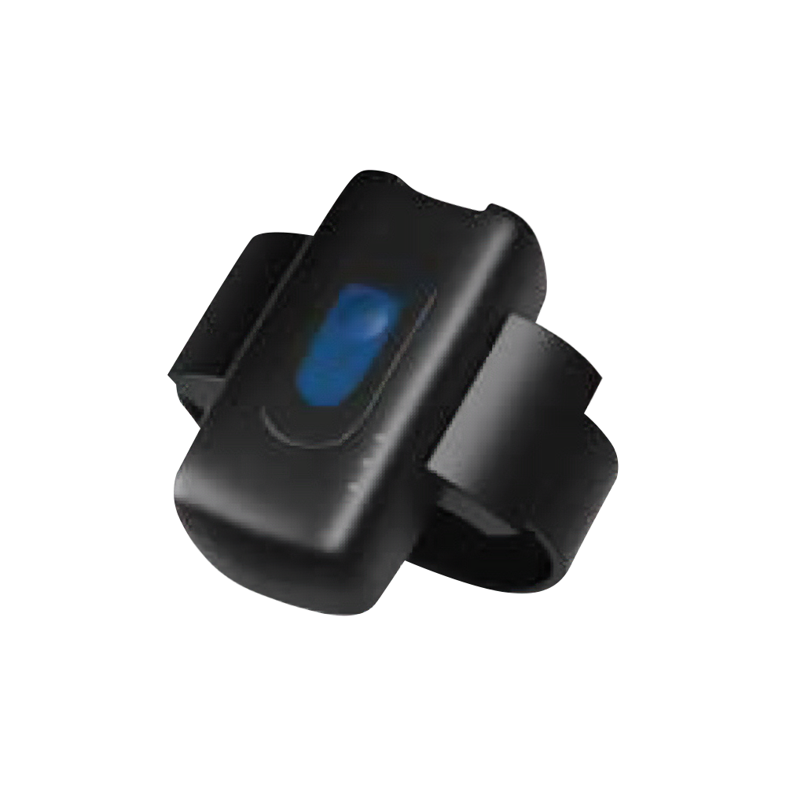

# SkyPatrol - SP1603

The SP1603 is a purpose built GPS tracker intended for offender monitoring and home detention programs. Designed as an ankle wearable, it focuses on reliable location reporting, continuous operation through an internal rechargeable battery, and clear tamper detection using a fiber optic belt. The device also offers optional in home beacon integration to help verify presence within approved premises.

Because the SP1603 is designed to be Plaspy compatible, it can integrate into electronic monitoring workflows for centralized oversight. When paired with Plaspy the tracker supplies location and status data that Plaspy can use for map visualization, alerting, and audit ready reporting to support caseworkers and program administrators.

## Key Highlights

- Plaspy compatible GPS tracker for streamlined integration into monitoring workflows
- Accurate real time tracking to support compliance monitoring and incident response
- Dual SIM cellular connectivity to improve on air resilience and reduce outages
- Dedicated tamper detection and a fiber optic belt that indicates strap compromise
- Internal rechargeable battery to maintain continuous operation between charges
- Optional in home beacon integration to validate residence presence for house arrest
- Purpose built for offender monitoring and home detention with an ankle wearable form

## How It Works with Plaspy

The SP1603 streams compliant location and status information into Plaspy where telemetry is normalized and presented for operational use. Plaspy applies configurable rules to incoming events so supervisors and response teams receive timely notifications and maintain an audit trail for each incident.

- Real time location and telemetry updates delivered to Plaspy for map visualization and time stamped logs
- Tamper and fiber optic belt alerts sent to Plaspy to trigger immediate notifications and incident workflows
- Battery and power status reporting visible in Plaspy to help schedule recharges and maintenance
- Optional in home beacon presence detection reported to Plaspy to confirm residence compliance
- Connectivity status including dual SIM indicators shown in Plaspy to aid uptime monitoring and diagnostics

## Typical Use Cases

- Parole and probation compliance monitoring with live location and tamper alerts
- Home detention and house arrest programs using optional in home beacons to confirm presence
- Rapid incident response when strap compromise or unauthorized movement is detected
- Caseworker workflows that depend on battery and connectivity telemetry for scheduling checks
- Temporary supervision assignments that require a discreet ankle wearable for continuous oversight

## Why Choose This Tracker with Plaspy

The SP1603 is a focused choice for organizations running electronic monitoring programs that need reliable position fixes, robust tamper detection, and practical wearability. Dual SIM capability and a rechargeable power design help maximize on air time, while the fiber optic belt offers a clear, detectable signal of strap compromise that supports custody grade supervision. These device characteristics align with Plaspy’s strengths in incident alerting, timeline reporting, and centralized case visibility.

To learn more about Plaspy and how it can centralize telemetry and alerts for devices like the SP1603 visit https://www.plaspy.com. Product specifications, availability, and manufacturer details can change over time, so please verify current technical information and compatibility on the manufacturer site https://www.skypatrol.com/.
