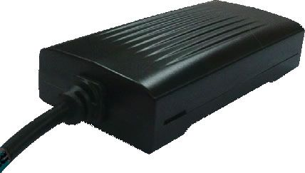

# SkyPatrol - SP2600

The SkyPatrol SP2600 Series is an economical GPS tracking device designed to provide reliable location and motion monitoring without unnecessary extras. It targets users who need straightforward fleet tracking and asset monitoring, offering core features such as over the air firmware updates, a 3 axis accelerometer for motion sensing, a single input and output for basic integrations, and an optional backup battery to maintain operation during vehicle power loss.

As a Plaspy compatible device, the SP2600 can feed its core telemetry into Plaspy for centralized visibility and operational oversight. Its combination of affordability, motion sensing, and FOTA capability makes it a practical choice when you want dependable device behavior tied into Plaspy dashboards, alerts, and reporting for fleet or asset management.

## Key Highlights

- Economical design focused on essential tracking features for fleet and asset management
- Optional 750 mAh backup battery to support operation during main power loss
- FOTA capability for remote firmware updates and easier device maintenance
- Built in 3 axis accelerometer for motion and activity detection
- One input and one output for simple integrations or external signal monitoring
- Available in 2G and 3G variants with coverage across the listed 3G bands
- Designed for 12 and 24 volt mobile vehicle environments with quick installation

## How It Works with Plaspy

When used with Plaspy, the SP2600 delivers the device location and motion information that Plaspy consumes for tracking, alerts, and reporting. Plaspy can present live location, historical routes, and event driven notifications based on the SP2600 data so fleet managers and operators get a consolidated view of operations.

- Live location and history viewing in Plaspy for fleet oversight and route review
- Motion based events from the accelerometer to trigger activity alerts or status changes
- Power loss and backup battery behavior visible in Plaspy to track device continuity
- Use of the device input and output to reflect external events or control simple outputs within operational workflows
- Consolidated reporting and operational dashboards driven by SP2600 telemetry
- Grouping and device status monitoring to manage fleets at scale within Plaspy

## Typical Use Cases

- Cost conscious fleet tracking for small to medium vehicle fleets
- Monitoring of delivery and service vehicles with basic motion and location needs
- Rental or shared vehicle tracking where essential telemetry is required
- Asset tracking for trailers and mobile equipment that need dependable connectivity
- Operations that benefit from remote firmware updates to keep devices current

## Why Choose This Tracker with Plaspy

The SP2600 is a pragmatic choice for organizations that need dependable, no frills tracking hardware paired with a capable software platform. Its optional backup battery and motion sensing add resilience and useful event data while FOTA helps reduce the on site maintenance burden. Paired with Plaspy, these features enable effective monitoring without unnecessary complexity.

Plaspy provides the operational context and tooling to make the SP2600 useful across standard fleet and asset workflows, including location monitoring, event alerts, and consolidated reporting. If you are evaluating simple, reliable trackers to integrate into Plaspy, the SP2600 is worth considering for use cases that prioritize cost effectiveness and essential telemetry.

To learn more about Plaspy and how compatible devices are managed, visit https://www.plaspy.com. Product specifications, availability, and manufacturer details for the SkyPatrol SP2600 can change over time, so please verify current specifications on the manufacturer site https://www.skypatrol.com/.
