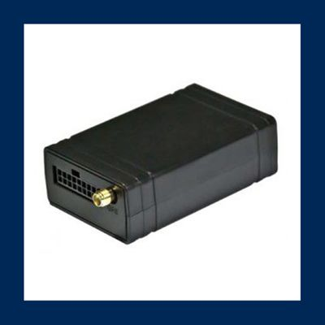

# SkyPatrol - SP4603

The SP4603 Series from SkyPatrol is a feature-rich GPS tracking device designed for highly demanding applications such as fleet management and field dispatch. It is also suitable for mainstream uses like insurance telematics and vehicle location/recovery. This quad-band GSM/GPRS tracking device is available in both 2G and 3G versions to cater to the specific needs of different enterprises.

One of the standout features of the SP4603 Series is its advanced functionality, including over-the-air device management and maintenance system. This system allows for easy programming, updates, and logistics management of the device. Additionally, the device supports FOTA \(Firmware update over the air\), ensuring that you always have the latest firmware version for optimal performance.

The SP4603 Series also offers GSM jamming detection, which is crucial for ensuring the security and reliability of your tracking system. With 28 hardware-based geofences, you have the flexibility to set up virtual boundaries and receive alerts when a vehicle enters or exits a specific area.

In terms of specifications, the SP4603 Series features a built-in GPS module for accurate positioning and tracking. It has various input/output options for connecting to external devices, allowing for expanded functionality and integration with other systems. The device is powered by a reliable electrical system and comes in a compact and durable physical design.

With its advanced features, flexibility, and capability, the SP4603 Series is an excellent choice for improving the performance of your fleet. Contact the SkyPatrol team today for a demo of their products and find the GPS tracking device that best fits your needs.

### Key Features:

- Quad-band GSM/GPRS tracking device
- Available in 2G and 3G versions
- Over-the-air device management and maintenance system
- FOTA \(Firmware update over the air\)
- GSM jamming detection
- 28 hardware-based geofences
- Built-in GPS module
- Various input/output options
- Compact and durable design

