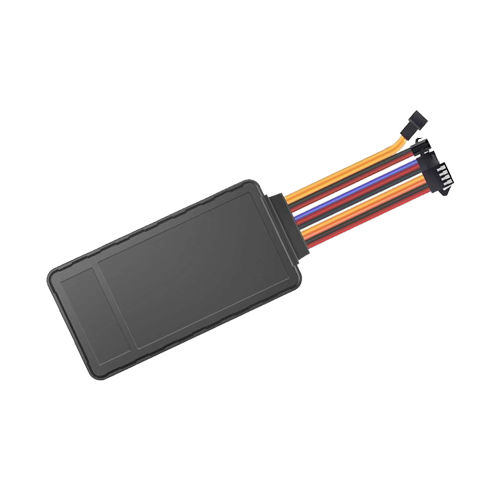

# SkyPatrol - SP4824

The SP4824 is a latest generation vehicle GPS tracker from SkyPatrol designed for wide carrier and country certifications. It targets vehicle location applications across subprime automotive, commercial fleet deployments, and consumer telematics. The device combines reliable real time tracking, robust telemetry channels and flexible I/O to support monitoring and anti theft workflows that fleets and service providers commonly require.

As a Plaspy compatible device, the SP4824 streams location and peripheral data into Plaspy for centralized visibility and operational oversight. Its mix of LTE 4G Cat1 with 2G fallback, high sensitivity GNSS, two way audio and an internal backup battery make it a practical choice for fleet management, driver identification, remote diagnostics and secure vehicle recovery when paired with Plaspy services.

## Key Highlights

- Designed for broad carrier and country certifications to simplify regional deployments
- Real time location tracking with LTE 4G Cat1 and 2G fallback for continuous updates
- High sensitivity GNSS receiver to improve position reliability in varied environments
- Multiple digital and analog I O plus a serial port and 1 wire interface for peripheral integration
- Built in two way audio for driver communication and event verification
- Internal backup battery to maintain reporting and basic tracking during power loss

## How It Works with Plaspy

When connected to Plaspy, the SP4824 delivers GNSS coordinates and peripheral events into a unified telematics platform where data becomes actionable through maps, alerts and reports. Plaspy ingests location and sensor data and presents it for live monitoring, historical analysis and operational alerts so teams can respond to events and track assets efficiently.

- Real time location and telemetry updates sent to Plaspy for live map tracking and geofence notifications
- Digital and analog I O events available in Plaspy as ignition, door or alarm status depending on wiring
- Serial port data can be surfaced in Plaspy for external sensor or third party device integration
- 1 wire interface data used for driver ID or temperature logging within Plaspy records
- Two way audio capability supports voice verification and driver support workflows during events

## Typical Use Cases

- Fleet management with live tracking, route history and utilization reporting
- Subprime automotive and consumer telematics where driver ID and asset visibility are required
- Anti theft and vehicle recovery supported by backup reporting, two way audio and timely alerts
- Temperature sensitive shipments or basic cold chain monitoring using 1 wire sensors
- Remote diagnostics and telemetry collection via analog inputs and serial integrations

## Why Choose This Tracker with Plaspy

The SP4824 provides a balanced set of connectivity and interface options that make it a strong match for organizations using Plaspy for fleet and vehicle programs. Its certification focused design helps reduce deployment friction across markets, while the combination of high sensitivity GNSS and an internal backup battery improves the reliability of location reports and critical event delivery. Flexible I O and serial connectivity let integrators incorporate driver identification, sensors and vehicle telemetry without extensive gateways.

Paired with Plaspy’s platform capabilities for real time tracking, alerting and reporting, the SP4824 can be part of a scalable solution for operational visibility, recovery workflows and telematics services. Learn more about Plaspy on the main website https://www.plaspy.com. Product specifications and availability can change over time, so please verify current technical details and certifications with the manufacturer at https://www.skypatrol.com/.
