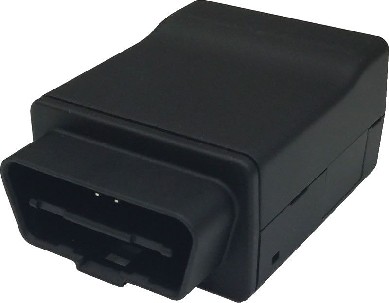

# SkyPatrol - SP7401

The SkyPatrol SP7401 is a CDMA GPS tracking device specifically designed for easy and reliable installation in automobiles. With its full range of features and affordable price, it is an ideal solution for various automotive applications. Whether you need it for automotive insurance, driver behavior management, auto rental, or any other automotive-related use, the SP7401 has got you covered.

One of the standout features of the SP7401 is its compatibility with the vehicle diagnostics interface, also known as OBD-II. This means that you can easily access and monitor important vehicle data such as engine performance, fuel efficiency, and diagnostic trouble codes. This feature is particularly useful for automotive insurance purposes, as it allows for accurate assessment of driver behavior and vehicle condition.

With the SkyPatrol SP7401, you can enjoy peace of mind knowing that your vehicle is being tracked and monitored effectively. Its reliable CDMA technology ensures strong and consistent signal reception, allowing for real-time tracking and location updates. The device is also equipped with a backup battery, ensuring continuous operation even in the event of power loss.

Overall, the SkyPatrol SP7401 is a cost-effective and feature-rich GPS tracking device that offers a wide range of applications in the automotive industry. Its easy installation, compatibility with OBD-II, and reliable performance make it a top choice for anyone in need of vehicle tracking and monitoring capabilities.

### Outstanding Features:

- CDMA technology for reliable signal reception
- Compatibility with OBD-II for easy access to vehicle diagnostics
- Real-time tracking and location updates
- Backup battery for continuous operation
- Cost-effective and easy to install

