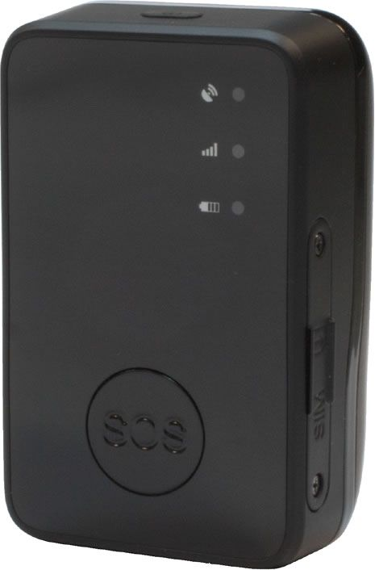

# SkyPatrol - SP8502

The SkyPatrol SP8502 is a compact, portable GPS tracker designed to provide location awareness and basic personal safety features. Its small size makes it easy to carry or conceal, and it is presented as suitable for monitoring field personnel, seniors, children, and other individuals who may benefit from discreet tracking. A notable built in user alert button adds an immediate way for a tracked person to signal for attention when needed.

As a Plaspy compatible device, the SP8502 can be integrated into Plaspy workflows to extend location visibility and alert handling across teams or families. When paired with Plaspy, the tracker’s location updates, user activated alerts, and boundary notifications become part of a centralized tracking environment for monitoring, notifications, and operational oversight without needing separate viewer tools.

## Key Highlights

- Compact and portable design that is easy to carry or conceal for discreet tracking
- User activated alert button to notify designated contacts in an emergency
- Real time location updates accessible from smartphones and PCs
- Boundary alerts to inform when a device moves outside predefined areas
- Suited for both personal safety and light duty workforce monitoring
- Durable construction intended for regular daily use

## How It Works with Plaspy

Plaspy receives the SP8502 location and alert information and presents it within a unified tracking platform, enabling teams to monitor status and respond to events from a single interface. Integration focuses on visibility, event handling, and historical location context rather than low level device configuration.

- Live map view of SP8502 devices for immediate positional awareness
- Incoming user alert events appear as notifications for rapid response
- Geofence or boundary alerts delivered through Plaspy alerting channels
- Location history and activity logs available for reporting and review
- Centralized monitoring across multiple SP8502 units for operational oversight

## Typical Use Cases

- Monitoring field personnel such as couriers or mobile technicians
- Keeping track of seniors or children for caregiver peace of mind
- Lone worker safety using the user activated alert button for distress signaling
- Short term or temporary deployments where a small portable tracker is preferred
- Basic fleet or team tracking where discrete, personal devices are useful

## Why Choose This Tracker with Plaspy

The SP8502 is a practical option when you need a small, easy to deploy tracker that emphasizes portability and a simple alert mechanism. Paired with Plaspy, it provides organizations and families a straightforward way to consolidate location visibility and alerting into an operational platform used for monitoring and response.

Because the SP8502 focuses on core tracking and a manual alert feature, it is a good fit for scenarios that prioritize discreet carryability and direct user signaling. Plaspy adds value by bringing those device events into broader monitoring, notification, and reporting workflows so teams can act on location information and alerts more efficiently.

To learn more about using Plaspy with compatible devices visit https://www.plaspy.com. Product specifications and availability can change over time so please verify current details and official documentation on the manufacturer site https://www.skypatrol.com/
