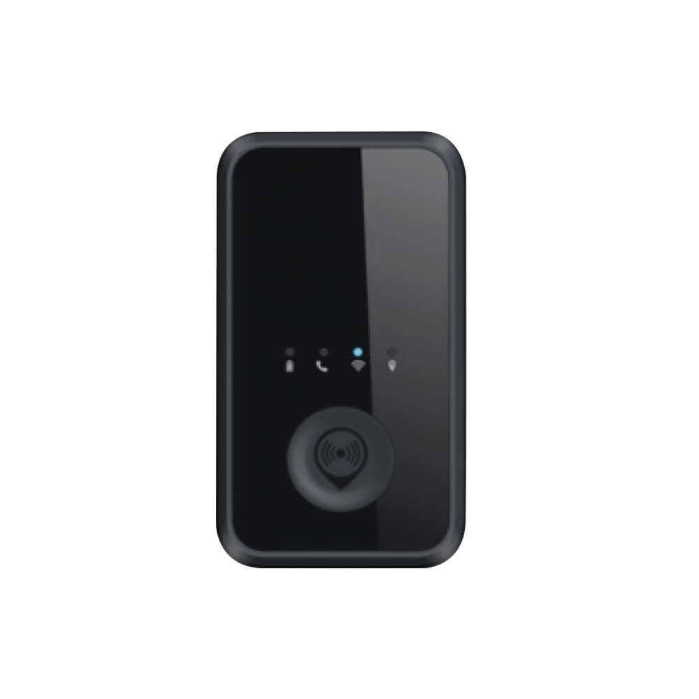

# SkyPatrol - SP8703

The SP8703 is a compact personal tracking device designed for Plaspy compatible deployments where reliable, low-power location and safety reporting matter. With built-in Wi‑Fi, dual cellular support \(3G and 2G\), an SOS button and a 3‑axis accelerometer, the SP8703 is positioned for personal safety, lone‑worker protection and portable asset monitoring while integrating with Plaspy for centralized visibility.

Plaspy compatible out of the box, the SP8703 delivers timely alerts and location updates without draining batteries. Its internal battery and low power consumption strategy make it a practical choice when continuous real‑time tracking and telemetry are needed for individuals or small high-value assets, without the complexity of vehicle-focused features like ignition inputs or immobilizers.

## Key Highlights

- Plaspy compatible — easy integration with Plaspy dashboards, alerts and reporting for centralized monitoring.
- Dual cellular connectivity \(3G & 2G\) plus Wi‑Fi — improved location reliability in urban and indoor environments.
- SOS button for immediate panic alerts — one‑press emergency notifications to Plaspy when help is needed.
- 3‑axis accelerometer — motion and fall detection enable intelligent telemetry and tamper awareness.
- Internal rechargeable battery with low power consumption — extended standby and operational life for personal use.
- Compact, lightweight form factor — unobtrusive on body, bags or portable assets for discreet tracking.
- Designed for personal safety rather than vehicle telemetry — suited to scenarios where fleet features like ignition or fuel monitoring are not required.

## How It Works with Plaspy

When paired with Plaspy, the SP8703 transmits location and status data into Plaspy’s real‑time tracking environment so administrators and caretakers can view live positions, receive alarms and run telemetry reports. The device uses cellular networks and Wi‑Fi to determine and refine location — Plaspy consolidates those inputs into map views, alert rules and historical playback.

- Real‑time location and telemetry updates — position fixes are forwarded to Plaspy for live tracking and history.
- SOS/panic alerts — one‑tap SOS notifications trigger Plaspy alerts with the device’s last known location.
- Motion and fall detection — accelerometer data provides motion events and tamper indicators to Plaspy.
- Wi‑Fi assisted positioning — improves indoor or urban canyon accuracy where GNSS may be limited.
- Battery and power status reporting — Plaspy receives battery level and low‑power alerts to manage device uptime.

## Technical Overview

| Connectivity | 3G and 2G cellular networks; Wi‑Fi connectivity |
| --- | --- |
| Bands | Not specified in the device description |
| Power & Battery | Internal battery; low power consumption optimized for extended standby |
| Interfaces | SOS button; 3‑axis accelerometer; no vehicle ignition or immobilizer interfaces specified |
| GNSS | Not specified in the device description |
| Bluetooth | Not mentioned in the device description |
| Remote Management | Not specified in the device description |
| Form Factor | Compact personal tracker for wearable or portable asset use |

## Use Cases

- Personal safety and lone‑worker protection — SOS button and motion alerts integrated into Plaspy for rapid response.
- Elderly care and vulnerable persons — discreet real‑time tracking and fall detection for caregivers and families.
- Portable asset monitoring — track briefcase, equipment or other small valuables in transit using Wi‑Fi and cellular reporting.
- Event staff or temporary workforce tracking — low power, compact device for short‑term deployments where fleet features are unnecessary.

## Why Choose This Tracker with Plaspy

The SP8703 delivers focused functionality for organizations that need dependable Plaspy compatible personal tracking without the overhead of vehicle‑centric telemetry. Its combination of Wi‑Fi and 3G/2G connectivity, SOS capability and accelerometer‑based motion detection provides a practical, battery‑efficient solution for real‑time tracking, anti‑theft alerts and personal safety workflows. Integrating the SP8703 into Plaspy gives you centralized visibility and alerting, while avoiding unnecessary vehicle interfaces like ignition or immobilizer hardware when they are not required.

Choose the SP8703 with Plaspy when your priority is clear, low‑power real‑time tracking and reliable emergency signaling for people and portable assets — a streamlined approach to telemetry that complements full fleet management solutions and can sit alongside other Plaspy compatible devices to create a comprehensive monitoring strategy.

