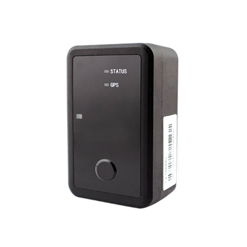

# SkyPatrol - SP9824

The SP9824 is a portable GPS asset tracker from SkyPatrol designed for long term deployments where maintenance windows are rare and environmental data matters. It combines a rugged, waterproof enclosure with onboard light and temperature sensing and tamper detection, enabling location and condition monitoring for pallets, containers, trailers, and static assets in outdoor or refrigerated environments.

As a Plaspy compatible device, the SP9824 feeds location and telemetry into Plaspy’s fleet management and asset monitoring dashboards. Its long battery life and environmental sensors make it a practical choice for organizations that want persistent visibility, threshold alerts, and historical reporting in Plaspy without frequent device maintenance.

## Key Highlights

- Up to seven years of battery life under optimized power management for low maintenance deployments
- IP67 rated enclosure suitable for outdoor maritime and refrigerated environments
- Integrated temperature and light sensors for condition monitoring and cold chain visibility
- Tamper detection to enable anti theft alerts and immediate event logging in Plaspy
- Portable form factor for pallets containers trailers and static assets
- Designed to provide location and telemetry to Plaspy for real time tracking and reporting

## How It Works with Plaspy

When integrated with Plaspy the SP9824 supplies periodic location updates and sensor telemetry that Plaspy ingests to present live maps event alerts and historical reports. Plaspy turns these device messages into operational visibility and conditional workflows that teams can use for monitoring and response.

- Live map visualization of reported positions and recent activity for each SP9824 device
- Event alerts in Plaspy for tamper incidents and sensor threshold breaches such as temperature excursions
- Historical reporting and trend charts for temperature and light data to support cold chain audits
- Grouping and filtering of assets for fleet level oversight and targeted notifications
- Battery and deployment duration monitoring to plan maintenance for long term installations

## Typical Use Cases

- Cold chain logistics monitoring for refrigerated shipments and temperature sensitive goods
- Cargo and container tracking to detect tampering and follow long haul movements
- Static asset monitoring for remote equipment or fixtures with infrequent access
- Pallet and trailer attachment for long duration asset visibility during storage and transit
- Environmental condition checks at temporary sites or seasonal installations

## Why Choose This Tracker with Plaspy

The SP9824 is well suited for organizations that prioritize low maintenance and environmental awareness in their tracking strategy. Its extended battery life and IP67 protection reduce servicing needs and increase uptime, while onboard sensors and tamper detection extend the value beyond basic positioning to include condition based alerts and anti theft workflows when combined with Plaspy.

If your operations focus on asset protection cold chain assurance or long duration deployments the SP9824 offers a clear fit as a Plaspy compatible asset tracker. For deployments that require vehicle control interfaces or additional telemetry types verify available variants and specification details with the manufacturer to ensure the device matches your operational requirements.

Learn more about Plaspy on our main website https://www.plaspy.com. Product specifications availability and manufacturer details can change over time so please verify current specifications with SkyPatrol at https://www.skypatrol.com/.
