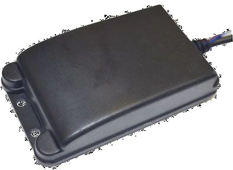

# SkyPatrol - ST7200

The SkyPatrol ST7200 is a highly regarded GPS tracking device specifically designed for motorcycles and powersports vehicles. With its impressive track record of recovering hundreds of powersport vehicles, including motorcycles, ATV's, personal watercraft, snowmobiles, and UTV's, the ST7200 is a reliable and trusted choice for vehicle owners.

One of the standout features of the ST7200 is its low power consumption, which helps to preserve the vehicle's battery life. This is particularly important for powersports vehicles that may not be used frequently or for long periods of time. Additionally, the ST7200 is equipped with an internal backup battery, ensuring that the device continues to function even if the vehicle's battery is disconnected or drained.

Designed to withstand the rugged conditions of powersports activities, the ST7200 is both water and vibration resistant. This means that it can handle the challenges of off-road adventures, water sports, and other demanding environments. Furthermore, the ST7200 operates on the widely adopted 2nd generation digital network, ensuring reliable and accurate tracking data.

With its impressive recovery rate, low power consumption, and durable design, the SkyPatrol ST7200 is an excellent choice for anyone looking to protect their powersports vehicles and enjoy peace of mind while out on the road or trail.

### Outstanding Features:

- Designed specifically for powersports vehicles
- Low power consumption to preserve vehicle battery
- Internal backup battery for continued functionality
- Water and vibration resistant for rugged conditions
- Operates on the widely adopted 2nd generation digital network

