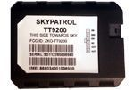

# SkyPatrol - TT 9200

The SkyPatrol TT 9200 is a compact GPS tracker that pairs modern GPS chipsets with SkyPatrol's EDDIE+ custom protocol. It supports a broad set of geofencing options including circular and polygonal geofences, route geofencing, and device-based corridors, and can store up to 250 device-based geofences or 24 point device corridors. Designed for everyday tracking tasks, the TT 9200 emphasizes long battery life, global GSM connectivity, and durable splash-proof housing for reliable field use.

As a device compatible with Plaspy, the TT 9200 can be used to bring its location, geofence, and counter data into a centralized fleet management environment. Plaspy users can leverage the TT 9200's geofencing capacity, corridor monitoring, and long endurance characteristics to improve operational visibility and reporting across vehicles and assets, while keeping configuration and monitoring within the Plaspy platform.

## Key Highlights

- Compact form factor suited for discreet vehicle and asset tracking
- Supports up to 250 device based geofences and 24 point device corridors
- Multiple geofence types including circular polygonal and route geofencing
- Low power consumption for extended operational intervals
- Quad band GSM modem for wide international network compatibility
- Durable splash proof housing and high GPS sensitivity at -162 dBI

## How It Works with Plaspy

The TT 9200 can feed location and event data into Plaspy so teams can monitor movement, enforce geofence rules, and generate operational reports from a single platform. Plaspy ingests the device messages and exposes them through map views, alerting, and reporting tools that support fleet and asset oversight.

- Display real time and historical position traces on Plaspy maps for live monitoring
- Configure geofence alerts in Plaspy using device based circular polygonal or route geofences
- Use corridor and route events to detect deviations and support route compliance in Plaspy
- Aggregate the device counters and event summaries into Plaspy reports for operational analysis
- Receive configurable notifications and alerts from Plaspy when device events occur

## Typical Use Cases

- Fleet vehicle tracking for delivery and service operations
- International asset tracking where wide GSM compatibility is required
- Route monitoring and corridor compliance for logistics workflows
- Long duration tracking scenarios that benefit from low power operation
- Asset security and location awareness for portable equipment

## Why Choose This Tracker with Plaspy

The TT 9200 combines a compact design with a feature set aimed at flexible geofencing and long runtime, making it a practical choice for organizations that need reliable location reporting across borders. When paired with Plaspy, the device's geofence capacity and corridor features can be used to create detailed monitoring rules and reports without adding unnecessary complexity.

Plaspy provides the centralized tools to visualize TT 9200 positions, manage geofence alerts, and consolidate counters and event data into operational dashboards. For teams evaluating trackers, the TT 9200 is a solid candidate when geofence versatility, international GSM coverage, and efficient power usage are priorities.

To learn more about Plaspy and how it supports devices like the SkyPatrol TT 9200 visit https://www.plaspy.com. Product specifications and availability can change over time so please verify current technical details and support information with the manufacturer at https://www.skypatrol.com/
