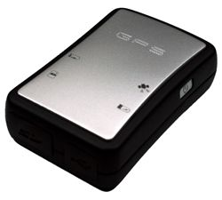

# Stars Nav - Photo GPS

The StarsNav Photo GPS is a revolutionary device that makes organizing and geo-tagging your photos a breeze. Unlike other GPS loggers, this device does not require any installation or setting up. Simply plug it into your PC, and it will be recognized as a removable storage device. With its unique design of using micro SD cards as storage, you can extend the storage capacity as much as you like. This means you can store a large number of photos without worrying about running out of space.

One of the standout features of the StarsNav Photo GPS is its compatibility with popular geo-tagging software packages and web album services such as Locr and Picasa. This allows you to easily organize and share your photos with friends and family. The device also supports Google Panoramio, making it even easier to showcase your photos on this popular platform.

In terms of hardware, the StarsNav Photo GPS is designed to be compact and lightweight, making it easy to carry around with you. It features 4 LED indicators that provide information on GPS status, memory status, charging, and error/low power warning. The device is powered by a rechargeable Li-ION battery, which provides an impressive operation time of up to 24 hours.

The StarsNav Photo GPS uses a high-performance GPS chipset, ensuring accurate and reliable location data. The GPS data saving interval is set to 8 seconds in power-saving mode, allowing you to capture detailed information about your journey. The logged data file format is TEXT, which includes longitude, latitude, altitude, time, speed, and direction.

Overall, the StarsNav Photo GPS is a user-friendly and feature-packed device that makes organizing and geo-tagging your photos a breeze. Its compatibility with popular software packages and web album services, along with its unlimited storage capacity, make it a standout choice for photographers and travel enthusiasts.

