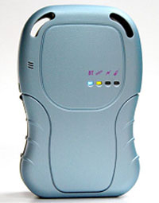

# Stars Nav - PT-33 Lite

The PT-33 Lite is a compact, SMS-based GPS tracker designed for reliable personal safety and low-bandwidth real-time tracking. As a Plaspy compatible device, the PT-33 Lite brings simple location requests, panic alerts, and motion-aware notifications into Plaspy dashboards or workflows through its SMS/call reporting model. It is ideal where data connections are limited but fast, actionable position reports are required.

The PT-33 Lite emphasizes straightforward operation: call or send an SMS to request an immediate location report, or trigger automatic alerts from the dedicated panic button, motion detector, geo-fence and speed alarms. This Plaspy compatible GPS tracker is suited for lone workers, children, elderly care, and basic asset monitoring — providing core telemetry and safety notifications without the complexity of continuous data telemetry or advanced fuel monitoring integrations.

## Key Highlights

- Plaspy compatible: SMS-based location reports and alerts can be integrated into Plaspy workflows for centralized monitoring and logging.
- Immediate location requests by call or SMS — quick, on-demand real-time tracking without continuous data usage.
- Dedicated panic button: press for 3 seconds to send an emergency alert to predefined contacts or systems.
- Intelligent motion detection and immobility alerts — beeps and SMS notifications if the tracker remains motionless for over one minute.
- Configurable geo-fencing and speed-based alerts, including movement-pattern detection for park/geo-fence violations.
- Speed alarm configurable up to a 120 km/h threshold for overspeed alerts during transit.
- Low-bandwidth, SMS-first design simplifies setup and maintenance compared to data-only trackers.

## How It Works with Plaspy

The PT-33 Lite reports GPS coordinates and event alerts via SMS or voice-triggered responses. When used with Plaspy, these SMS location reports and alert messages can be forwarded into Plaspy’s data intake \(for example, via an SMS gateway, manual forwarding, or Plaspy’s supported ingestion method\) so that position data and event notifications appear on Plaspy maps and in reporting tools. Because the tracker relies on SMS rather than continuous cellular data, it fits Plaspy deployments that require dependable, low-bandwidth real-time tracking and safety alerts.

- Real-time location and telemetry updates delivered by SMS in response to calls or text requests.
- Panic/emergency alerts from the dedicated panic button \(3-second press\) mapped into Plaspy alerts.
- Motion and immobility alerts: audible beep after 1 minute of no movement and subsequent SMS notification forwarded into Plaspy.
- Geo-fence and speed-based alerts \(including park/movement-pattern detection and a configurable 120 km/h speed alarm\) synced to Plaspy event logs.
- Simple SMS/phone command interface — useful where Bluetooth sensors, remote immobilizer control, or continuous telemetry are not required.

## Technical Overview

| Model | PT-33 Lite |
| --- | --- |
| Manufacturer | Not specified |
| Connectivity | GSM / SMS \(cellular SMS and call based reporting\) |
| Bands | Not specified |
| Power & Battery | Not specified |
| Interfaces | Dedicated panic button, built-in motion sensor, SMS/phone command interface |
| GNSS | GPS coordinates provided for mapping \(compatible with Google Earth\) |
| Bluetooth | Not specified / no Bluetooth sensors mentioned |
| Remote Management | SMS-command configuration; no FOTA or web remote management specified |
| Form Factor | Compact personal GPS tracker for wearable or small asset use |

## Use Cases

- Personal safety for children or elderly relatives — instant location requests and an easy panic button for emergencies.
- Lone worker monitoring where real-time tracking and emergency alerts are essential but cellular data is limited.
- Basic asset tracking and anti-theft monitoring for small equipment or personal property that only needs periodic location reports.
- Light fleet management scenarios that require low-bandwidth, Plaspy compatible units for tracking specific personnel or high-value portable assets.
- Short-term rentals and shared equipment oversight where geo-fencing and speed alerts help enforce usage rules without continuous telemetry.

## Why Choose This Tracker with Plaspy

The PT-33 Lite offers a dependable, low-complexity approach to GPS tracking that integrates cleanly into Plaspy environments. Its SMS-first design reduces data requirements and simplifies deployment, while panic, motion, geo-fence, and speed alerts deliver the essential telemetry and anti-theft notifications many users need. For organizations or families seeking a Plaspy compatible GPS tracker focused on safety and straightforward location reporting — rather than advanced fuel monitoring, ignition control, immobilizer functions, or Bluetooth sensor ecosystems — the PT-33 Lite provides a practical, cost-effective solution.

In short, choose the PT-33 Lite when you want Plaspy compatible real-time tracking, reliable emergency alerts, and easy SMS-based operation that keeps monitoring simple, scalable, and focused on safety and core telemetry.

