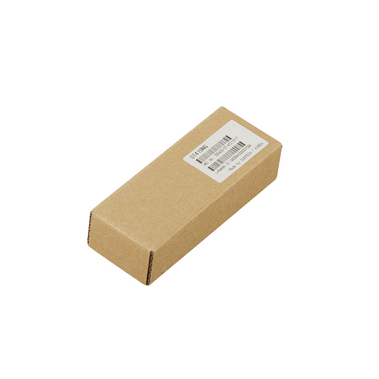

# Suntech - ST419NG

The ST419NG Series is a compact GPS tracker designed for reliable Plaspy compatible asset and vehicle monitoring. It combines GPRS and LoRa communications with an integrated 900 MHz RF module to provide flexible connectivity across mixed deployments. The device is described as having a small form factor, an extended backup battery and configurable protocols, making it suitable for scenarios where continuous location reporting and basic telemetry are required.

As a Plaspy compatible device, the ST419NG is relevant for operators who need adaptable reporting paths and straightforward integration. Its dual communication approach and local RF capabilities let Plaspy receive location updates in cellular areas while also supporting low power wide area connectivity and short range recovery workflows. Built in motion sensing, GNSS positioning with LBS fallback, configurable I O options and memory download modes further help tailor reporting behavior to Plaspy driven monitoring and operational needs.

## Key Highlights

- Plaspy compatible GPS tracker offering both GPRS and LoRa channels for flexible connectivity.
- Integrated 900 MHz RF module for short range radio links and on site recovery assistance.
- Built in 2,700 mAh backup battery for extended reporting during power loss or tamper events.
- Compact form factor suitable for concealed vehicle or portable asset installations.
- Motion sensing and configurable I O options across variants to support event based alerts.
- Configurable transmission protocols and LIFO FIFO memory download modes to optimize data transfer and power use.

## How It Works with Plaspy

When connected to Plaspy, the ST419NG provides location and event information that supports fleet visibility, recovery workflows and asset oversight. Plaspy can accept the device's position and telemetry through the device's available communication channels while using configurable upload behavior to balance report frequency and power consumption.

- Real time GPS location and telemetry updates to Plaspy over GPRS or via LoRa where available.
- Motion based alerts and event reporting to highlight movement or tamper conditions.
- LBS fallback ensures continuity of coarse location reporting when GNSS signals are limited.
- Local 900 MHz RF links can assist recovery or short range messaging integrated into Plaspy workflows.
- Memory download using LIFO or FIFO lets Plaspy retrieve queued logs after connectivity is restored.

## Typical Use Cases

- Fleet management for vehicles requiring discreet tracking and regular location reporting.
- Anti theft and recovery operations using concealed installation and local RF assistance.
- Motorcycle and compact vehicle tracking where small size and backup power are important.
- Asset monitoring in mixed connectivity environments using a combination of LoRa and GPRS.
- Site or yard operations where short range radio links improve on site telemetry aggregation.

## Why Choose This Tracker with Plaspy

The ST419NG Series is a practical option for organizations that value flexible communications and dependable reporting. Its mix of GPRS, LoRa and a dedicated 900 MHz RF channel reduces dependency on a single link type, while the backup battery and motion sensing improve resilience during power interruptions or tamper events. Configurable transmission options and memory download modes let integrators tune how the device interacts with Plaspy to meet data, battery and reporting cadence goals.

Plaspy users looking for a compact tracker that supports mixed connectivity deployments will find the ST419NG a useful fit for many fleet and asset scenarios. Its variant options and configurable interfaces make it adaptable to different operational requirements without relying on a single deployment pattern.

To learn more about Plaspy and how it can work with compatible devices like the Suntech ST419NG visit https://www.plaspy.com. Product specifications, availability and manufacturer details can change over time, so please verify the current specifications on the official Suntech website http://www.suntechint.com/.
