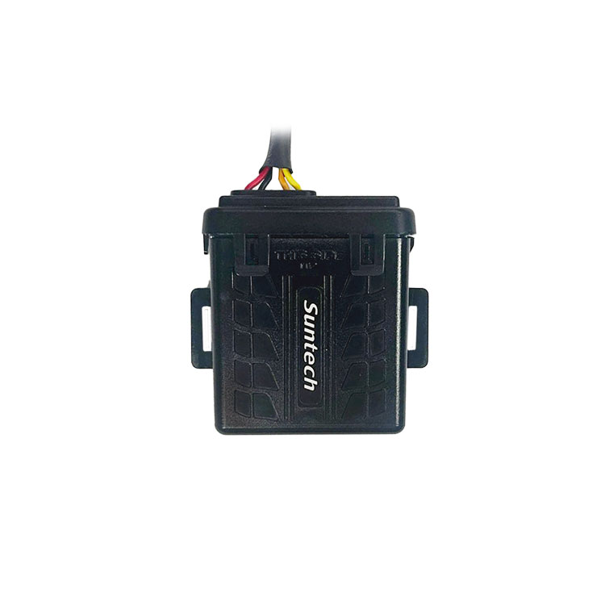

# Suntech - ST4215/U

The ST4215/U is a compact, rugged GPS tracker designed for vehicle and asset monitoring in demanding conditions. It combines global cellular connectivity with multi GNSS positioning and a sealed IP67 housing to deliver continuous location and event reporting for fleet and recovery operations. The unit is engineered for durability and uninterrupted connectivity, with a small footprint suitable for many vehicle and equipment installations.

As a Plaspy compatible device, the ST4215/U streams location, motion and input/output events into Plaspy for live visibility, alerts and historical analysis. That compatibility makes it straightforward to ingest the tracker’s position updates and event messages into Plaspy dashboards and reporting workflows, enabling actionable insights for fleet managers and operations teams.

## Key Highlights

- Plaspy compatible using standard TCP and UDP data transport for real time tracking and telemetry.
- Rugged IP67 waterproof enclosure with a compact 61 x 61 x 20.7 mm form factor for outdoor and vehicle use.
- Global cellular support with LTE Cat M1 and NB2 plus 2G fallback for broad regional coverage.
- Multi GNSS positioning including GPS GLONASS Galileo Beidou with high accuracy and up to 10 Hz update rate for fine telemetry.
- Integrated 3 axis accelerometer for motion detection and higher resolution position reporting.
- Onboard backup battery for power loss reporting and continued status updates during wired power interruptions.
- Wiring variants and accessory compatibility for ignition and event inputs to support trip segmentation and event logging.

## How It Works with Plaspy

Connecting the ST4215/U to Plaspy enables continuous ingestion of GNSS fixes, motion and event data so fleets can monitor assets in real time and review historical activity. Plaspy receives the device’s periodic and event triggered messages and translates them into live map positions, alerts and reports that support operational oversight.

- Real time location and telemetry updates for live tracking dashboards and route replay.
- Motion and ignition style events reported to Plaspy for automated alerts and trip segmentation.
- Geofence event forwarding for perimeter alerts and compliance monitoring.
- Accelerometer based motion data and multi point reporting for fine tracking and incident analysis.
- Backup battery and power loss notifications to preserve visibility during power interruptions.

## Typical Use Cases

- Fleet tracking for cars vans and trucks where rugged hardware and reliable connectivity are required.
- Theft recovery and anti theft monitoring using motion detection geofencing and backup battery alerts.
- Asset tracking in harsh outdoor environments such as trailers equipment and field assets.
- High resolution telemetry for route analysis and incident reconstruction using frequent GNSS updates.
- Event and access logging with accessory support for driver authentication and external sensor inputs.

## Why Choose This Tracker with Plaspy

The ST4215/U pairs rugged design with efficient cellular connectivity and precise multi GNSS positioning, making it a practical choice for organizations that need dependable monitoring in challenging conditions. Its compact IP67 housing, broad power input range and backup battery support help maintain visibility for vehicles and assets that operate outdoors or in harsh environments. When combined with Plaspy, the tracker’s frequent position updates and event reporting enable real time alerts geofence enforcement and detailed historical reporting that support recovery and operational efficiency.

If you want to learn more about how Plaspy can work with this device visit https://www.plaspy.com. Product specifications availability and manufacturer details can change over time so please verify current specifications on the official Suntech website http://www.suntechint.com/.
