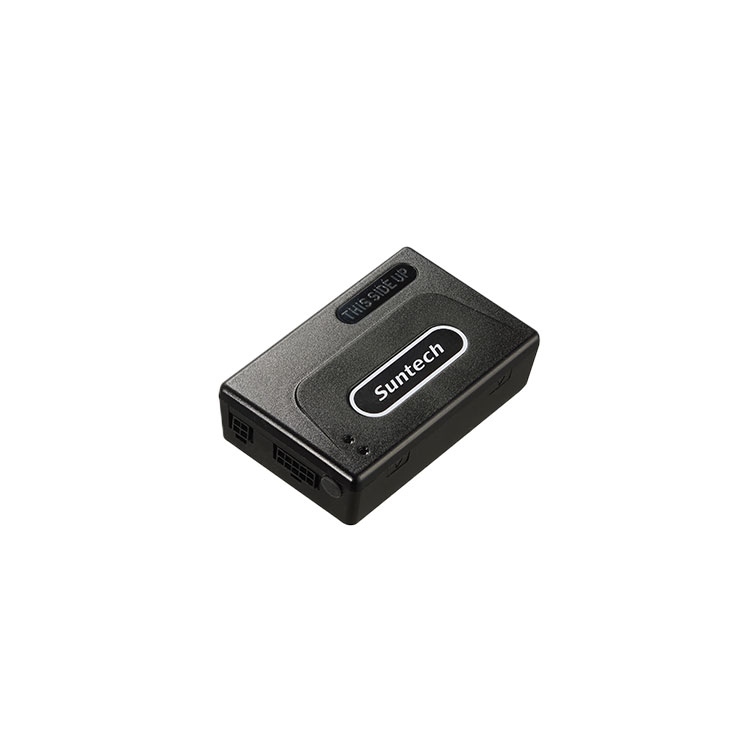

# Suntech - ST4305

The Suntech ST4305 is a rugged wired vehicle GPS tracker from the ST4305 series designed for fleet managers and vehicle recovery services. It provides continuous GNSS based positioning and telematics through multi network cellular coverage, and is offered in multiple variants that address different installation and telemetry needs. The family combines a compact vehicle grade form factor with a 14 pin connection harness and configurable reporting suited to fleet environments.

As a Plaspy compatible device, the ST4305 can feed location, event and status data into Plaspy for real time visibility, alerts and historical reporting. Its configurable reports, virtual ignition detection and event capabilities make it a practical hardware choice for organizations that want to use Plaspy for operational oversight, incident review and vehicle recovery workflows.

## Key Highlights

- Plaspy compatible vehicle tracker with multi network cellular coverage for broad area reach and cost effective data transport.
- Offered in multiple variants to match integration needs: ST4305, ST4305R and ST4305RE.
- Integrated GNSS positioning with configurable reporting for live tracking and historical playback.
- Advanced telematics features including Driving Pattern Analysis and Crash Reconstruction plus optional jamming detection to support safety and security workflows.
- Virtual ignition detection using voltage and motion inputs to enable ignition aware reports and workflows.
- 14 pin wired harness with multiple inputs and outputs for alarm and immobilizer integration, plus a backup battery to preserve reporting during power interruption.
- Maintenance server support and downloadable device files to simplify deployment and device management.

## How It Works with Plaspy

The ST4305 transmits GNSS positions and device telemetry over cellular networks to Plaspy, where that data is processed into live maps, alerts and reports. Plaspy ingests events and configurable messages from the device so fleet teams can monitor vehicles, respond to incidents and analyse historical trends.

- Real time location and telemetry updates appear on Plaspy live maps for monitoring and route review.
- Ignition and motion status from the device allow Plaspy to distinguish vehicle on and off states for tailored reports and alerts.
- Geofence events and security alerts are relayed to Plaspy for perimeter breach notifications and route enforcement.
- Driving Pattern Analysis and Crash Reconstruction events can be delivered to Plaspy for safety review and incident reporting.
- Power loss, backup battery status and optional jamming detection are reported for anti theft monitoring and recovery assistance.
- RS 232 serial output and external antenna options in R and RE variants enable additional telemetry feeds that Plaspy can incorporate into diagnostics and maintenance workflows.

## Typical Use Cases

- Fleet management for real time tracking, route oversight and driver behaviour reporting.
- Vehicle recovery and anti theft operations using jamming alerts, backup battery reporting and geofence notifications.
- Safety and incident investigation using driving event and crash reconstruction data for post incident analysis.
- Remote diagnostics and maintenance scheduling by streaming serial telemetry from RS 232 capable variants.
- Integration with alarm and immobilizer systems to enable remote immobilization or automated security responses.

## Why Choose This Tracker with Plaspy

The ST4305 series offers a balance of vehicle grade connectivity, configurable reporting and variant options that fit many fleet and security deployments. Its wired 14 pin harness and RS 232 options provide practical paths for integrators to capture vehicle signals and telemetry, while the device level event processing supplies Plaspy with the structured data needed for dashboards, alerts and historical analysis.

For organizations that require consistent tracking, incident context and recovery features, the ST4305 family is a practical Plaspy compatible choice. To learn more about Plaspy and how devices like the ST4305 work within the platform visit https://www.plaspy.com. Product specifications and availability can change over time, so please verify current technical details and variant options on the manufacturer website http://www.suntechint.com/
