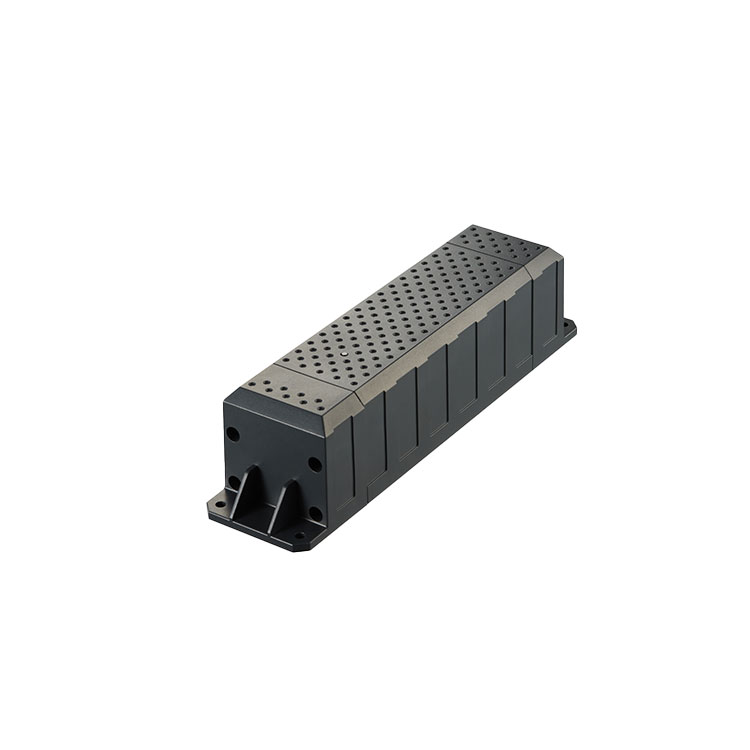

# Suntech - ST4915

The ST4915 series from Suntech is a rugged, long life GPS tracker designed for unattended asset monitoring. It is built around an ultra high capacity primary battery and modern low power cellular radios to deliver multi year, low maintenance operation for trailers, containers, equipment, and other remote assets where reliability and battery longevity matter.

The ST4915 is Plaspy compatible out of the box, making it straightforward to add these devices to Plaspy fleets and asset groups. When used with Plaspy, the ST4915 provides continuous location visibility, event reporting, and long term telemetry collection that reduces the need for frequent maintenance visits.

## Key Highlights

- Exceptionally long battery life for multi year autonomous operation, reducing maintenance and replacement cycles
- Plaspy compatible out of the box for straightforward integration into maps, dashboards, and reporting
- Rugged enclosure and industrial durability for harsh environments, suitable for trailers and outdoor equipment
- High accuracy GNSS positioning with modern receiver technology for reliable location fixes
- Flexible digital inputs and motion sensing for door, panic, and movement event detection
- Optional Bluetooth and Wi Fi assistance on selected variants to extend sensor and proximity capabilities
- Firmware update capability and standard IoT transport for ongoing device lifecycle support

## How It Works with Plaspy

The ST4915 transmits GNSS positions and telemetry to Plaspy using standard IoT transport, and Plaspy ingests location, motion, and digital input events for use in dashboards, maps, and automated workflows. Reporting intervals and event thresholds can be tuned to balance visibility and battery consumption according to operational needs.

- Real time location and telemetry updates delivered over cellular IoT radios with fallback for broad coverage
- Motion and impact detection reported to Plaspy for event driven alerts and tamper monitoring
- Ignition, door, and panic input events surfaced in Plaspy for security and engine state correlation
- Optional Bluetooth and Wi Fi assistance forwarded to Plaspy for enhanced geolocation and external sensor data
- Telemetry channels available for external sensor integrations such as fuel or environmental sensors when paired appropriately

## Typical Use Cases

- Trailer and container tracking for long term unattended location reporting and loss prevention
- Heavy equipment and machinery monitoring to support fleet oversight and maintenance planning
- Remote asset fleets deployed off grid where multi year battery life reduces operational overhead
- Environmental aware monitoring using Bluetooth or optional sensors to capture temperature and presence data
- Security and anti theft workflows that combine geofencing, motion alerts, and digital input events

## Why Choose This Tracker with Plaspy

The ST4915 family pairs long life primary battery engineering with modern low power radios and a rugged enclosure, making it a practical option for organizations that need reliable, low maintenance asset tracking. When connected to Plaspy, the device's location, motion, and input events are presented in a centralized platform for fleet visibility, reporting, and automated alerting.

For teams managing large numbers of remote assets, the ST4915 reduces service visits while providing the telemetry channels and optional sensor support needed for broader workflows. Plaspy's dashboards and reporting tools make the device data actionable for operations, security, and maintenance planning, while over the air update capability helps keep devices current throughout their deployed life.

Learn more about Plaspy on the main website https://www.plaspy.com. Product specifications and availability can change over time, so please verify current device details on the manufacturer's official website http://www.suntechint.com/.
