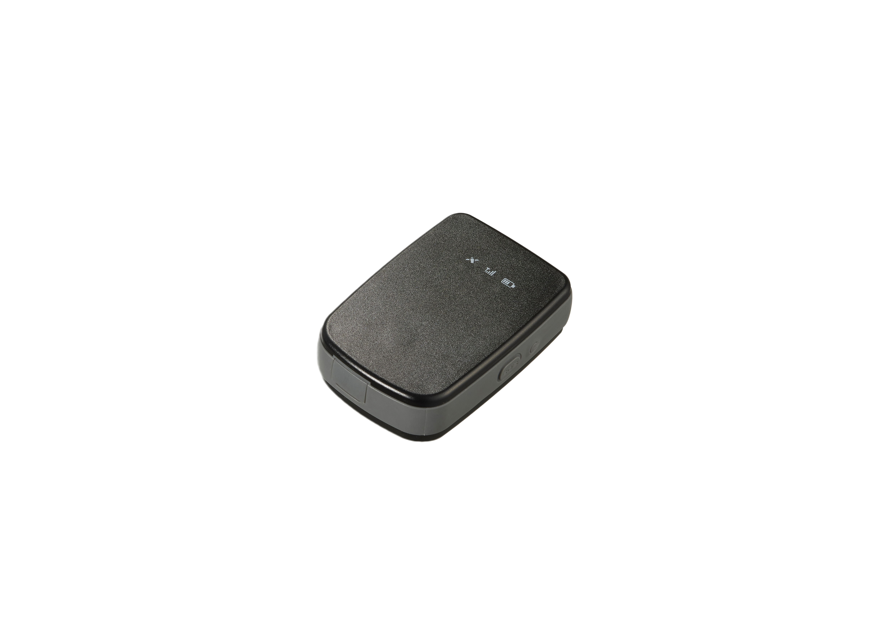

# Suntech - ST4945

The Suntech ST4945 is a compact portable GPS tracker built for basic tracking and monitoring tasks across people, messaging, package logistics, and fixed asset applications. It combines GNSS positioning with a 3-axis accelerometer for motion detection, a panic button for emergency status reporting, battery level alerts, and configurable geofencing capacity. Communication flexibility is provided through TCP UDP and SMS channels and the device supports current cellular technologies for broad connectivity.

As a model compatible with Plaspy the ST4945 can feed location points and device events into the Plaspy platform to enable centralized visibility and operational oversight. Its compact form and feature set make it suitable for scenarios where mobility and straightforward alerting are priorities, and Plaspy can surface those events as live tracking, geofence notifications, and historical reports for teams that manage people packages or assets.

## Key Highlights

- Portable compact design suited for on person use package tracking and temporary deployments
- 3-axis accelerometer for motion detection and movement based alerts
- Panic button to transmit emergency or status reports through the platform
- Geo fencing support with up to 200 circular fences for virtual boundary monitoring
- Multiple communications options including TCP UDP and SMS for flexible data delivery
- GNSS positioning with GPS and GLONASS and SBAS support for enhanced positioning accuracy
- Industry certificates such as FCC IC and PTCRB that reflect regulatory compliance

## How It Works with Plaspy

When paired with Plaspy the ST4945 delivers location and event data into the Plaspy dashboard where fleet managers and operations teams can monitor assets and people in one place. Plaspy ingests the tracker messages and presents them alongside alerts and historical records to support oversight and decision making.

- Live location tracking and map visualization for real time visibility
- Motion and panic alerts routed into Plaspy notifications for rapid response
- Geofence monitoring and entry exit notifications based on the device fence configuration
- Battery level alerts and device status reporting shown in Plaspy device lists and alerts
- Historical position logs and simple reporting to analyze routes and events
- Centralized device management context so teams can group tag and track units across operations

## Typical Use Cases

- Personal safety and lone worker monitoring where a compact tracker is required
- Parcel and courier tracking for last mile visibility and status reporting
- Temporary or portable asset tracking for field equipment and small tools
- Emergency alerting where a dedicated panic button is needed
- Short term rentals or loaned devices that require simple tracking and battery monitoring
- Logistics operations that use geofences to manage pickup and delivery zones

## Why Choose This Tracker with Plaspy

The ST4945 offers a practical balance of portability and core tracking features that align well with Plaspy customers looking for simple dependable devices. Its motion sensing panic reporting and multiple communication options help ensure that critical events and location updates reach Plaspy for timely presentation and action.

Combined with Plaspy the device becomes part of a broader operational toolkit: Plaspy collects and displays the ST4945 data so teams can set alerts produce reports and maintain oversight without managing low level device protocols. For organizations that need compact dependable tracking for people packages or assets the ST4945 is a sensible option to consider.

To learn more about how the ST4945 can work with Plaspy visit https://www.plaspy.com. Product specifications availability and manufacturer details can change over time so please verify current technical specifications and certifications on the official Suntech site http://www.suntechint.com/ before making a procurement decision.
