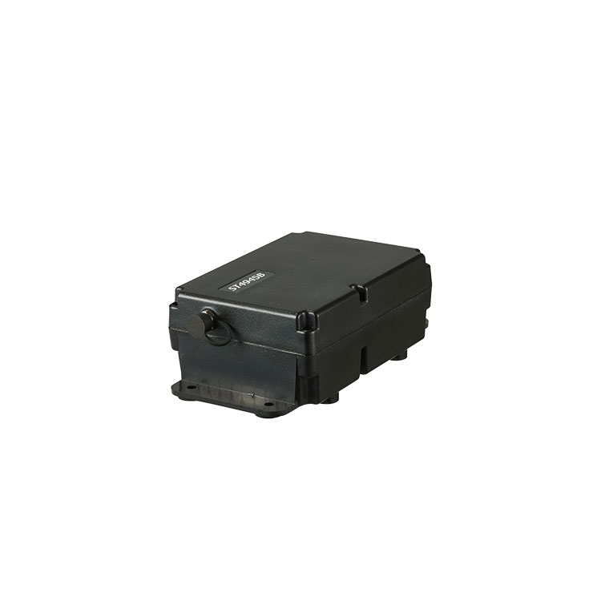

# Suntech - ST4945B

The ST4945B is a rugged GPS asset tracker from Suntech designed for long term, low power monitoring in demanding outdoor environments. Built around cellular IoT connectivity options and extended battery autonomy, the ST4945B targets applications such as container and trailer monitoring, fleet oversight, and remote asset recovery where durable hardware and sustained uptime are important.

As an out of the box Plaspy compatible device, the ST4945B streams real time location, motion based telemetry and event alerts into the Plaspy platform. That compatibility makes it straightforward to include the ST4945B in Plaspy deployments for continuous visibility, automated notifications and consolidated reporting across mixed fleets and remote assets.

## Key Highlights

- Plaspy compatible device providing real time tracking and telemetry over LTE Cat M1 and NB IoT with EGPRS fallback.
- Large rechargeable backup battery for extended service intervals and reduced maintenance visits.
- IP67 rated enclosure for dust and water resistance suitable for containers, trailers and outdoor assets.
- GNSS based location and motion reports that support tracking, history playback and event driven alerts.
- Jamming detection, low battery notifications and over the air firmware updates for remote device management.
- Optional BLE support for local sensor pairing and on site telemetry when required.

## How It Works with Plaspy

The ST4945B sends GNSS positions, motion events and device status messages to Plaspy using standard TCP or UDP data streams over cellular links. Plaspy ingests those messages to present live location, historical playback and rule based alerts in a centralized dashboard, making the device useful for operational monitoring and automated workflows.

- Real time location updates and history playback presented in Plaspy dashboards.
- Motion and movement based events forwarded to Plaspy for tamper, towing or cargo shift notifications.
- Low battery and jamming alerts delivered to Plaspy to trigger operator response or maintenance tasks.
- Geofencing, schedule based rules and automated notifications configured and managed inside Plaspy.
- Optional BLE sensor data can be associated with device telemetry in Plaspy for enhanced local monitoring.

## Typical Use Cases

- Container and trailer monitoring with motion alerts and tamper detection for long haul assets.
- Mixed fleet tracking where extended battery life and rugged housing reduce downtime.
- Asset recovery and anti theft workflows using motion alerts, geofence breach notifications and status monitoring.
- Remote equipment tracking for outdoor infrastructure and seasonal assets that require long autonomy.
- Site level telemetry using optional BLE sensors paired locally and reported through Plaspy.

## Why Choose This Tracker with Plaspy

Pairing the ST4945B with Plaspy provides a practical combination of rugged hardware and a flexible tracking platform. The device’s focus on long battery life, environmental protection and remote management features helps minimize field visits while keeping assets visible through Plaspy’s real time dashboards and alerting engine. For organizations managing containers, trailers or remote equipment, this pairing supports operational oversight, faster incident response and simpler lifecycle maintenance.

Learn more about Plaspy on the main website https://www.plaspy.com. Product specifications, availability and manufacturer details can change over time; please verify current specifications on the official Suntech site http://www.suntechint.com/.
