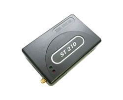

# Suntech - ST 210

The Suntech ST 210 is a GPS tracker that utilizes GPS and GPRS technology to provide real-time tracking of vehicles. With this device, you can easily monitor the location of your vehicles and ensure their safety. The ST 210 also offers a Geo-fencing service, allowing you to set up virtual boundaries for your vehicles. If a vehicle goes outside of the pre-set zone, an instant alert will be sent, providing you with peace of mind and the ability to take immediate action.

The Suntech ST 210 is designed for various applications, including track and trace, vehicle recovery, fleet management, and in-car navigation. It is equipped with a full quadband GSM band, ensuring reliable communication. The device also features voice capabilities, allowing for two-way communication. In addition, it has a backup battery and internal memory, ensuring that data is not lost in case of power failure.

With its sleep mode functionality, the ST 210 conserves power when the vehicle is not in use. It has multiple digital inputs, including pre-defined inputs such as ignition, and supports internal events based on specific triggers. The device is housed in a durable plastic casing and comes with GPS and GSM internal antennas. It also offers extra connectivity options, including fixed antennas, microphone/speaker, and a serial port.

Overall, the Suntech ST 210 is a reliable and feature-rich GPS tracker that is made in South Korea. It is an ideal choice for businesses and individuals looking to track and manage their vehicles efficiently and effectively.

