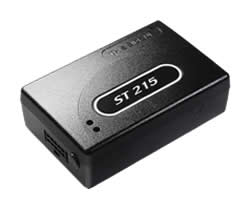

# Suntech - ST 215

The Suntech ST215 is a GPS vehicle tracker designed for track and trace, vehicle recovery, and fleet management applications. It features a quad-band GSM/GPRS modem and internal GPS and GSM antennas, ensuring reliable and accurate location reporting. With its versatile positioning capabilities, the ST215 can provide location reports based on time, distance, or angle change, allowing for precise tracking and monitoring of vehicles.

One of the standout features of the ST215 is its flexibility. It is available in several versions, each offering different technical characteristics such as event-related features, digital inputs and outputs, and the ability to connect with Can Bus. This allows users to choose the version that best suits their specific needs and requirements.

The ST215 also comes equipped with a backup battery and internal memory, ensuring that data is stored and transmitted even in the event of power loss. It supports communication methods such as GPRS, TCP, and UDP, providing reliable and efficient data transmission.

Overall, the Suntech ST215 is a reliable and feature-rich GPS vehicle tracker that is ideal for track and trace, vehicle recovery, and fleet management applications. Its advanced features, flexible options, and high-quality construction make it a top choice for businesses and individuals looking to effectively monitor and manage their vehicles.

### Outstanding Features:

- Quad-band GSM/GPRS modem for reliable communication
- Internal GPS and GSM antennas for accurate location reporting
- Flexible positioning options based on time, distance, or angle change
- Versatile versions with different technical characteristics
- Backup battery and internal memory for data storage and transmission
- Supports GPRS, TCP, and UDP communication methods
- Multiple digital inputs and outputs for enhanced functionality
- Pre-defined inputs for ignition, panic, and doors
- Can Bus connectivity for advanced vehicle monitoring
- High-quality construction for durability and reliability

