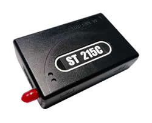

# Suntech - ST 215C

The Suntech ST 215C is a GPS vehicle tracker designed for fleet management and track and trace applications. It provides direct connection to vehicle bus standards J1939 and OBDII for access to vehicle data relevant to monitoring and reporting. The unit includes an internal GPS antenna with the option for an external antenna, internal GSM antennas with full quadband support, and multiple inputs for ignition, panic, door sensors, plus an analogue input. Positioning can be configured by time distance and angle change, and the device includes internal memory and event based reporting with a sleep mode to conserve power.

As a Plaspy compatible device the ST 215C can deliver position and event data into Plaspy for centralized visibility and fleet oversight. Its support for common cellular communication methods and onboard event reporting makes it a practical option for organizations that want to integrate vehicle location, status inputs, and vehicle bus information into Plaspy dashboards, alerts, and reports. Compatibility enables operators to view tracking history and receive actionable notifications within the Plaspy platform.

## Key Highlights

- Direct connection to J1939 and OBDII vehicle bus standards for vehicle data access
- Internal GPS and GSM antennas with option for external or fixed antennas
- Full quadband GSM support and common cellular communication methods for reliable coverage
- Positioning configurable by time distance and angle change for flexible tracking
- Multiple digital inputs including ignition panic and door plus an analogue input for event reporting
- Internal memory and events based reporting to help preserve data during temporary loss of connectivity

## How It Works with Plaspy

The ST 215C transmits location updates and device events over standard cellular communication methods that Plaspy can receive and process. Once connected, Plaspy aggregates location, event and vehicle bus data into a single fleet view and makes that information available for monitoring and operational reporting.

- Real time location and breadcrumb history visible on Plaspy maps for fleet oversight
- Event monitoring for digital inputs such as ignition panic and door events with alerting options
- Vehicle bus data from J1939 and OBDII can be used in Plaspy reporting and dashboard metrics for maintenance planning
- Configurable alerts for movement geofence breaches and input triggered events
- Historical reports and trip summaries generated from stored position and event data
- Internal memory on the device helps ensure data continuity that Plaspy can reconcile after reconnection

## Typical Use Cases

- Fleet vehicle tracking for logistics and delivery operations
- Route adherence and trip history for operational compliance and optimization
- Driver safety and incident reporting using panic and door input events
- Remote diagnostics and maintenance planning using vehicle bus data
- High value asset protection and recovery with configurable alerts and location history

## Why Choose This Tracker with Plaspy

The ST 215C is a practical choice for fleets that need both location tracking and access to vehicle bus information. Its combination of internal antennas and optional external hardware choices helps address signal reception needs, while event based reporting and internal memory support continuous operational monitoring. These capabilities align well with Plaspy's focus on centralized tracking visibility and fleet reporting.

For organizations that require flexible communication and a device that can surface vehicle status alongside location, the ST 215C offers a balanced feature set to feed data into Plaspy for dashboards alerts and analysis. Its configurable positioning rules and multiple inputs make it suitable for a range of fleet and asset tracking scenarios.

To learn more about how Plaspy can work with the Suntech ST 215C visit https://www.plaspy.com. Product specifications availability and manufacturer details can change over time so verify current specifications on the Suntech official site http://www.suntechint.com/ before making procurement or deployment decisions.
