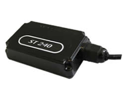

# Suntech - ST 240

The Suntech ST240 is a reliable and durable GPS tracker designed specifically for vehicle tracking. With its plastic cover and IP67 waterproof rating, it is ideal for installations in compact vehicles. The ST240 utilizes GPS technology to accurately report the position of the vehicle by changing angle, distance, or time. It also features an internal backup rechargeable Li-Polymer battery with a capacity of 450mAh, ensuring continuous tracking even in the event of a power outage.

With a full quadband GSM band, the ST240 offers seamless communication and connectivity. It supports various communication methods including GPRS, TCP, and UDP, allowing for efficient and reliable data transmission. The tracker also comes equipped with internal memory, enabling it to store important data and information. Additionally, the ST240 features sleep mode functionality, conserving power when the vehicle is not in use.

The Suntech ST240 is an excellent choice for track and trace applications, vehicle recovery, and fleet management. It offers a range of features including multiple digital inputs, pre-defined inputs such as ignition and panic buttons, and internal events based on user-defined parameters. The ST240 is made in South Korea, ensuring high-quality craftsmanship and reliable performance. Trust the Suntech ST240 to provide accurate and real-time tracking for your vehicles.

### Key Features:

- Plastic cover with IP67 waterproof rating
- GPS position reporting by changing angle, distance, or time
- Internal backup rechargeable Li-Polymer battery \(450mAh\)
- Full quadband GSM band
- Supports GPRS, TCP, and UDP communication methods
- Internal memory for data storage
- Sleep mode functionality
- Multiple digital inputs
- Pre-defined inputs for ignition and panic
- Internal events based on user-defined parameters
- GPS and GSM internal antennas
- Made in South Korea

