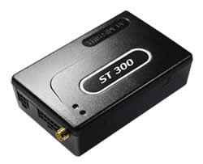

# Suntech - ST 300

The Suntech ST300 is a versatile GPS vehicle tracker and telematics device designed to meet the information needs of businesses and individuals who want improved visibility and control over vehicles. The ST300 family includes multiple variants such as ST300V (Voice), ST300R (RS232), ST300B (Basic), ST300A (Advance), ST300P (Passenger Counter), ST300C (Can Bus), ST300F (Fuel Sensor), ST300H (High), and ST300K (Can Bus + 1 wire), giving fleets a choice of configurations to match different operational requirements.

As a device compatible with Plaspy, the ST300 can feed location, event and auxiliary data into a modern fleet platform for monitoring, reporting, and operational oversight. Its full quadband GSM communication, voice capability, internal memory, backup battery and flexible event reporting make it a practical option for organizations that want a robust tracker integrated with Plaspy for day to day fleet management and longer term telematics analysis.

## Key Highlights

- Part of a broad ST300 family with variants for voice, passenger counting, fuel sensing, and Can Bus integration
- Full quadband GSM support for wide geographic coverage
- Voice capability for two way communication on supported variants
- Internal memory and backup battery for data continuity during connectivity interruptions
- Position reporting by time, distance, and angle change for adaptable tracking behavior
- Multiple digital and analogue inputs plus extra connectivity options for auxiliary devices
- Durable plastic casing suitable for vehicle installations

## How It Works with Plaspy

When paired with Plaspy, the Suntech ST300 provides a stream of location and event data that Plaspy uses to deliver visibility, alerts, and reporting across a fleet. Plaspy ingests the device data and presents it in dashboards and reports that support operational decision making.

- Real time location and status visibility in Plaspy maps and live monitoring views
- Historical playback and trip reporting based on the ST300 position records
- Event and alarm handling for inputs such as ignition and other pre defined triggers
- Auxiliary data and sensor inputs surfaced in Plaspy reports when available from the device
- Offline buffering benefits from internal memory and backup battery to reduce data gaps
- Variant specific data such as Can Bus or fuel sensor readings can be incorporated where device configuration provides those signals

## Typical Use Cases

- Fleet tracking and dispatch for light vehicles and commercial fleets
- Vehicle recovery and theft deterrence with continuous location reporting
- Passenger transport monitoring using the Passenger Counter variant
- Fuel monitoring and operational efficiency analysis with the Fuel Sensor variant
- Telematics deployments that require a range of device options across a mixed fleet

## Why Choose This Tracker with Plaspy

The Suntech ST300 family offers flexibility through multiple hardware variants, which makes it suitable for organizations that need different capabilities across a mixed fleet. Combining ST300 devices with Plaspy gives operators centralized visibility and consistent reporting across those variants, helping to streamline fleet operations and oversight.

If you want a practical, feature rich tracker family that can integrate into a full fleet management platform, the ST300 series is a relevant option to consider for Plaspy deployments. Learn more about Plaspy on the main website https://www.plaspy.com. Product specifications, availability, and manufacturer details can change over time, so verify current technical specifications and variant availability with the official manufacturer documentation at http://www.suntechint.com/
