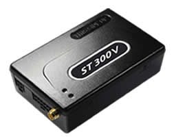

# Suntech - ST 300V

The Suntech ST 300V is a GPS vehicle tracker and driving control device designed for fleet management. It combines vehicle location tracking with in-cabin monitoring features and driver interaction capabilities. The device supports CAN Bus data extraction compatible with J1939 and OBDII standards and includes a 1-Wire interface for driver identification, making it suitable for operations that need driver level awareness and vehicle data alongside location history.

As a Plaspy compatible model, the ST 300V can be integrated into Plaspy's fleet monitoring platform to provide location visibility, driver identification, and vehicle data reporting within a single operational interface. Plaspy can use the ST 300V to present location maps, event history, and consolidated reports that help operations teams make informed decisions and maintain oversight across mixed fleets.

## Key Highlights

- Vehicle location tracking suitable for fleet monitoring and dispatch.
- Driver identification via 1-Wire interface for driver level awareness.
- CAN Bus reporting compatible with J1939 and OBDII for vehicle data extraction.
- Two way voice communication option for direct driver contact.
- Multiple communication methods and internal memory for data continuity.
- Backup battery for continued tracking if external power is interrupted.
- Flexible positioning modes based on configurable intervals or movement triggers.

## How It Works with Plaspy

When paired with Plaspy, the ST 300V provides live and historical vehicle information inside Plaspy dashboards and reporting tools. Plaspy ingests position updates and device events to create actionable views for fleet managers and operators.

- Display live vehicle positions and recent routes on Plaspy mapping views.
- Correlate driver ID events with vehicle activity to track who was operating each vehicle.
- Incorporate CAN Bus derived vehicle data into Plaspy reports for operational insights.
- Use voice communication features as part of driver contact workflows managed by dispatch teams.
- Leverage internal memory and fallback communication to ensure Plaspy receives delayed uploads when connectivity resumes.

## Typical Use Cases

- Fleet dispatch and route oversight for medium to large vehicle fleets.
- Driver identification and shift assignment tracking for multi driver vehicles.
- Vehicle performance and usage reporting using CAN Bus data in management reports.
- Direct driver communication for safety checks or route updates.
- Operations that require a tracking device with backup power and data persistence.

## Why Choose This Tracker with Plaspy

The ST 300V is a practical choice for organizations that need more than simple location updates. Its combination of driver identification and vehicle data access makes it useful where understanding who is driving and what the vehicle is doing matters for billing, compliance, or operational efficiency. Pairing the ST 300V with Plaspy brings those device capabilities into a centralized platform for monitoring and reporting.

Because the ST 300V supports multiple communication paths and on device storage, it can help maintain visibility in real world conditions where immediate connectivity is not always guaranteed. That resilience, together with Plaspy's mapping and reporting features, helps teams keep better operational control without overcomplicating workflows.

To learn more about how Plaspy works with Suntech devices and view platform features visit https://www.plaspy.com. Product specifications and availability can change over time, so verify current device details and official documentation on the manufacturer site http://www.suntechint.com/.
