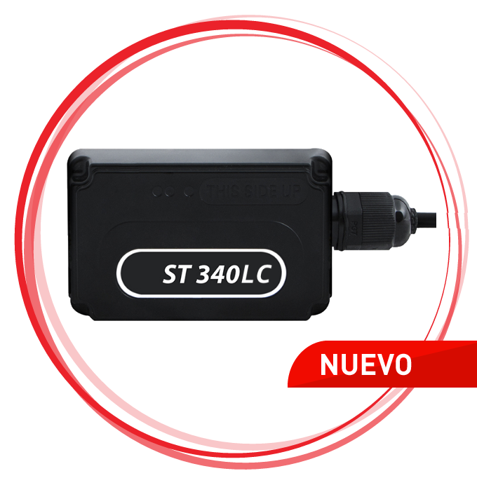

# Suntech - ST 340LC

The Suntech ST340LC is a compact and water-resistant GPS tracker that is designed to meet the needs of various industries. It offers a cost-effective solution without compromising on performance. This device is perfect for installation on motorcycles, vehicles, and is also suitable for insurance and buy-here-pay-here applications.

One of the standout features of the ST340LC is its low battery consumption, which helps to optimize implementation and operational costs. This means that you can rely on this tracker for long periods without worrying about frequent battery replacements. Additionally, the ST340LC integrates all the functionalities of the ST340, ensuring that you have access to a comprehensive set of features.

With its compact design and water-resistant capabilities, the Suntech ST340LC is a reliable and versatile GPS tracker that can be used in various vertical markets. Whether you need to track motorcycles, vehicles, or manage insurance and buy-here-pay-here operations, this device offers a cost-effective solution without compromising on performance.

