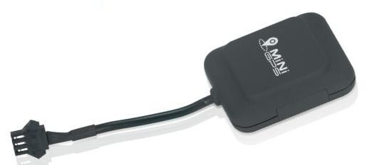

# Supermate - D10

The Supermate D10 GPS Tracker is an exceptional choice for a wide range of tracking needs, whether for personal, commercial, or industrial applications. With its compact and lightweight design, this tracker can be easily placed on various assets without drawing attention. Its user-friendly installation process ensures seamless integration into daily operations, making it accessible to users with varying levels of technical expertise.

One of the standout features of the Supermate D10 is its real-time tracking capability, providing users with live updates on the location of their assets. This allows for constant visibility and monitoring, ensuring that you are always aware of where your assets are located. The Geo-Fencing feature is particularly useful, allowing users to set boundaries and receive instant alerts when assets enter or leave these designated areas. This is especially valuable for fleet management or keeping track of personal belongings.

In addition to its tracking capabilities, the Supermate D10 GPS Tracker also includes an Emergency SOS Button, providing an extra layer of security. In critical situations, users can activate the SOS button to send instant alerts, ensuring that help can be dispatched promptly. This feature is particularly valuable for personal safety or for ensuring the well-being of loved ones.

### Key Features:

- Real-Time Tracking: Offers live updates for continuous monitoring of assets.
- Geo-Fencing: Set and monitor boundaries with instant alerts.
- Multi-Purpose Use: Ideal for tracking vehicles, personal items, or loved ones.
- Emergency SOS Button: Provides instant alerts in urgent situations.

The Supermate D10 GPS Tracker is optimized for portability and stealth, with a lightweight design that minimizes impact on asset mobility. It is built to withstand diverse environmental conditions, with a wide operational humidity range and temperature tolerance. The tracker supports multiple frequency bands for comprehensive GSM network coverage, ensuring reliable connectivity. With high GPS sensitivity, it offers precise location tracking even in urban environments. The durable design of the Supermate D10 ensures it can withstand daily use, and it complies with international safety and efficiency standards.

Whether you need to track vehicles, personal belongings, or ensure the safety of loved ones, the Supermate D10 GPS Tracker is an ideal solution. With its advanced security features, reliable location monitoring, and ease of use, you can have peace of mind knowing that what's important to you is under constant surveillance, no matter where in the world you are.

