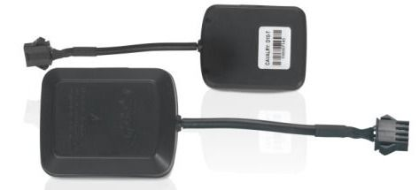

# Supermate - D10-T

The Supermate D10 GPS Tracker is an exceptional device that caters to a wide range of tracking needs, making it suitable for personal, commercial, and industrial applications. With its compact and lightweight design, this tracker can be easily placed on various assets without drawing attention. Its user-friendly installation process ensures that it can be seamlessly integrated into daily operations without requiring extensive technical knowledge.

One of the standout features of the Supermate D10 GPS Tracker is its real-time tracking capability, which provides users with live updates on the location of their assets. This allows for continuous visibility and monitoring, ensuring that you are always aware of the whereabouts of your valuable possessions. The Geo-Fencing feature is particularly useful, as it allows users to set boundaries and receive instant alerts when assets enter or leave these designated areas. This feature is invaluable for fleet management, asset protection, and personal safety.

In addition to its tracking capabilities, the Supermate D10 GPS Tracker also includes an Emergency SOS Button, which provides an added layer of security. In critical situations, users can press the button to send instant alerts, ensuring that help is on the way when it is needed most. This feature is especially beneficial for personal safety and emergency response scenarios.

With its outstanding features and reliable performance, the Supermate D10 GPS Tracker is an ideal choice for anyone in need of a versatile and dependable tracking solution. Whether you need to track vehicles, personal belongings, or ensure the safety of loved ones, this tracker has you covered. Its advanced security features and real-time monitoring capabilities make it an invaluable tool for keeping what's important to you under constant surveillance, no matter where in the world you are.

### Key Features:

- Real-Time Tracking: Offers live updates for continuous monitoring of assets.
- Geo-Fencing: Set and monitor boundaries with instant alerts.
- Multi-Purpose Use: Ideal for tracking vehicles, personal items, or loved ones.
- Emergency SOS Button: Provides instant alerts in urgent situations.

### Technical Specifications:

| Specification | Description |
| --- | --- |
| Dimensions | Optimized for portability and stealth |
| Weight | Lightweight for minimal impact on asset mobility |
| Power Input | Flexible voltage compatibility for global use |
| Operational Humidity | Built to withstand diverse environmental conditions |
| Temperature Tolerance | Functional in a range of climates |
| Connectivity | Supports multiple frequency bands for comprehensive GSM network coverage |
| Sensitivity | High GPS sensitivity for precise location tracking in urban environments |
| Durability | Robust design for enduring daily use |
| Compliance | Meets international safety and efficiency standards |

