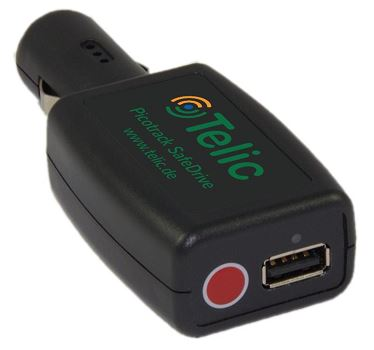

# Telic - SafeDrive

The Telic SafeDrive is a compact, plug and play GPS tracker built for telematics applications. Designed for quick connection to a vehicle 12V socket, the device supports temporary and mobile tracking scenarios with a small physical footprint and integrated USB socket for charging external devices. Its feature set and configurable settings make it suitable for a range of vehicle monitoring needs from delivery logistics to general fleet oversight.

As a Plaspy compatible device, the SafeDrive can be connected into a centralized tracking platform for visibility and operational control. Plaspy users can leverage the SafeDrive to add short term or permanent trackers to their fleet inventory, enabling location monitoring, assignment tracking, and consolidated reporting without complex hardware integration. The combination of the SafeDrive hardware and Plaspy software is useful where ease of deployment and straightforward tracking are priorities.

## Key Highlights

- Plug and play design for fast connection to a vehicle 12V socket and quick removal when needed  
- Integrated USB socket for charging smartphones or other small devices during use  
- Compact and discreet form factor suitable for varied vehicle types  
- Flexible settings and configuration options to tailor tracking behavior to operational needs  
- Well suited for temporary assignments such as subcontractor or courier tracking  
- Practical option for basic theft protection and general track and trace workflows

## How It Works with Plaspy

When paired with Plaspy, the SafeDrive becomes a managed tracking element within your fleet platform. Plaspy collects and presents location data and status information from compatible devices so teams can monitor vehicle movement and make operational decisions from one interface.

- Centralized visibility of vehicle locations and recent activity for fleet managers  
- Temporary assignment management for subcontractors or short term drivers using plug and play deployment  
- Alerts and notifications delivered through Plaspy for defined events and conditions set in the platform  
- Reporting and exportable location history to support logistics analysis and operational reviews  
- Grouping and filtering of devices in Plaspy to match business units, routes, or vehicle types

## Typical Use Cases

- Delivery logistics where drivers or subcontractors need temporary location tracking  
- Track and trace of vehicles and valuable loads during transport operations  
- Theft protection support by providing location visibility for recovery efforts  
- Monitoring business travel in company cars for policy and mileage oversight  
- Short term vehicle assignments and rentals where simple installation is required

## Why Choose This Tracker with Plaspy

The SafeDrive is a practical choice for organizations that need a low friction tracking option. Its plug and play nature enables rapid rollout across many vehicles without extensive installation work, making it especially useful for fleets that use temporary drivers or rotate devices among vehicles. The integrated USB outlet is a useful convenience for drivers who need to charge devices while on the road.

Paired with Plaspy, the SafeDrive provides straightforward location visibility and operational oversight within a single platform. Plaspy helps turn the device data into actionable information through consolidated monitoring, alerts, and reporting features, so teams can keep track of vehicles and streamline common telematics workflows.

To learn more about how Plaspy supports device compatibility and fleet management, visit the Plaspy main website https://www.plaspy.com. Product specifications, availability, and manufacturer details can change over time, so please verify current device specifications and options on the manufacturer site https://www.telic.de.
