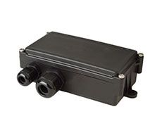

# Telic - SBC3 CAN

The Telic SBC3 CAN is a robust and versatile GPS tracker designed for demanding telematics applications. It is specifically developed to provide access to various vehicle interfaces, including serial interfaces \(RS232\), 1-wire, and CAN bus. With its durable housing, this device is suitable for use in harsh environments, making it ideal for industries such as transportation, logistics, and fleet management.

The SBC3 CAN is available in two antenna options: internal or external. The version with integrated antennas also offers a variant with a 4 Ah battery, providing extended battery life for longer tracking periods. This flexibility allows users to choose the configuration that best suits their specific needs and requirements.

Outstanding features of the Telic SBC3 CAN include:

- Access to various vehicle interfaces, including RS232, 1-wire, and CAN bus
- Robust housing for use in harsh environments
- Available with internal or external antennas
- Variant with a 4 Ah battery for extended battery life

