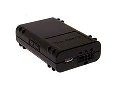

# Telic - SBC AVL

The Telic SBC AVL is a compact telematics unit designed for fleet management and related applications. It combines integrated GSM and GPS antennas with support for 1-wire and CAN-bus interfaces, offering a space efficient, cost conscious solution for locating units and basic vehicle level data collection. Its feature set is centered on reliable tracking, driver detection use cases, and straightforward integration into vehicle systems.

As a device compatible with Plaspy, the SBC AVL can feed location and telematics information into Plaspy's fleet management environment to improve visibility and operational oversight. Plaspy users can incorporate this model into vehicle lists and monitoring workflows to take advantage of live tracking, reporting, and alerting features while keeping commissioning costs low.

## Key Highlights

- Compact and cost effective telematics unit suitable for fleet deployment
- Integrated GSM and GPS antennas for reliable location acquisition
- Support for 1-wire and CAN-bus interfaces for integration with vehicle systems
- Versatile for fleet management tasks including driver detection
- Designed to reduce commissioning complexity and related costs
- Practical option for organizations seeking basic vehicle level insights

## How It Works with Plaspy

When connected to Plaspy, the SBC AVL supplies position and telematics data that Plaspy processes for real time visibility and historical analysis. The device's integrated antennas and interface options make it a straightforward candidate for adding vehicles to Plaspy-managed fleets, enabling monitoring and operational workflows.

- Real time location tracking displayed on Plaspy maps and dashboards
- Fleet status and vehicle availability monitoring for operations teams
- Alerts and notifications based on movement, geofences, or other configured triggers
- Reporting and historical playback for route review and performance analysis
- Use of vehicle level data to support maintenance planning and diagnostics where available

## Typical Use Cases

- Commercial fleet location tracking and route oversight
- Driver detection and basic behavior monitoring for operational control
- Asset tracking for light vehicles and service fleets
- Vehicle diagnostics and maintenance scheduling support in fleet workflows
- Reducing commissioning time and costs when deploying multiple units

## Why Choose This Tracker with Plaspy

The SBC AVL is a practical match for organizations using Plaspy that need a cost effective, compact telematics unit with integrated antennas and common vehicle interfaces. Its focus on fleet management and driver detection makes it suitable for businesses that want to improve visibility without investing in larger or more complex hardware platforms.

If you want to explore how the SBC AVL can fit into your Plaspy deployment, learn more about Plaspy on the main website https://www.plaspy.com. Product specifications and availability can change over time, so please verify current technical details and compatibility on the manufacturer's official site https://www.telic.de.
