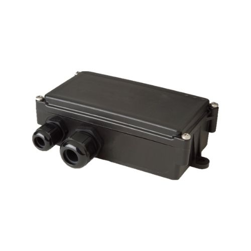

# Telic - SBC product family

The SBC product family from Telic is a rugged telematics platform designed for fleet management and vehicle tracking. Models such as the SBC3 CAN 4G and SBC AVL 4G provide a durable housing with an integrated antenna and multiple wired interfaces, enabling reliable long term operation in vehicle and trailer environments. These devices are built for quick installation and stable uplink for continuous tracking and telemetry collection.

As a Plaspy compatible device out of the box, the SBC family can stream position and telemetry into Plaspy for centralized monitoring, reporting, and automation. The combination of LTE Cat M1 connectivity and wired interfaces makes SBC units a practical choice when organizations need real time location visibility, telemetry capture from vehicle systems, and consolidated fleet workflows within Plaspy dashboards.

## Key Highlights

- Plaspy compatible and designed for real time telematics streaming over LTE Cat M1 networks
- Multiple wired interfaces including CAN bus, 1 Wire, and RS232 to capture vehicle and sensor signals
- Rugged housing with integrated antenna for dependable operation in vehicle and trailer installations
- Suited for fleet scale rollouts with consistent telemetry and centralized management in Plaspy
- Well suited to anti theft monitoring and basic immobilizer style workflows when combined with appropriate vehicle integrations
- Applicable to production data acquisition where serial or sensor signals need reliable capture and logging

## How It Works with Plaspy

When integrated with Plaspy, SBC devices deliver position and telemetry to a cloud platform for live monitoring, alerts, and historical analysis. Plaspy ingests location updates and wired interface data, maps those signals to dashboards and reports, and uses them to trigger geofence alerts and operational rules.

- Real time tracking and map views for live fleet visibility and route replay
- Vehicle telemetry capture from CAN bus and serial interfaces to feed fuel monitoring and engine related reporting when available
- Sensor recording from 1 Wire and RS232 connections for production counters and ancillary device data
- Alerting and automation driven by position and telemetry such as unauthorized movement notifications and operational alerts
- Consolidated reporting and history to support maintenance planning and performance analysis

## Typical Use Cases

- Fleet management and route visibility for mixed vehicle and trailer operations
- Trailer telematics for unpowered assets that require location and sensor logging
- Anti theft and security monitoring combining live location with vehicle status indicators
- Fuel monitoring and basic engine telemetry reporting when vehicle bus signals are available
- Automated production or process data acquisition from vehicle mounted devices and sensors

## Why Choose This Tracker with Plaspy

The SBC product family offers a stable hardware base for organizations that need robust telemetry capture alongside dependable location reporting. Its wired interfaces allow extraction of operational signals that Plaspy can surface in dashboards and reports, while the rugged design reduces downtime from environmental exposure or mounting challenges. For fleet managers and asset owners seeking a single platform to aggregate tracking and telemetry, SBC devices map cleanly into Plaspy workflows.

To learn more about how Plaspy can use SBC devices for your fleet and telemetry needs, visit https://www.plaspy.com. Product specifications and availability can change over time, so please verify current technical details and model variants on the official manufacturer site https://www.telic.de before finalizing procurement or integration plans.
