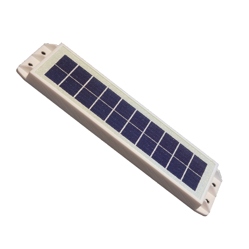

# Telic - Telic Solar

Telic Solar is a compact, IP69 rated GPS tracker-class device engineered for reliable long term location of mobile capital goods such as containers, swap bodies and freight wagons. Its very small, flat housing is designed to fit into common container beads while the integrated solar panel and energy management support extended autonomous operation, making it well suited for deployments that require persistent visibility with minimal on site maintenance.

As a Plaspy compatible device, Telic Solar forwards location and interior telemetry into Plaspy via Telic’s tracking application and configurable back end settings. This compatibility lets fleet and logistics teams combine location, interior environmental readings and device energy status inside Plaspy dashboards and reports, supporting monitoring, anti-theft workflows and long duration tracking campaigns.

## Key Highlights

- Plaspy compatible device for integrated tracking and asset visibility
- IP69 rated, very small and flat housing designed to fit into standard container beads
- Integrated solar panel and energy management for extended autonomous operation
- Directional Bluetooth antenna to receive interior sensor telemetry from inside containers
- Includes Telic tracking application software with options for configuration and data forwarding
- Cost optimised design balancing durability and long term operational costs
- Robust construction suited for intermodal logistics and harsh handling environments

## How It Works with Plaspy

Telic Solar transmits location and interior sensor telemetry through Telic’s tracking application so Plaspy can ingest and present combined location, sensor, and energy information. Once the device data reaches Plaspy, fleet managers can view asset position alongside environmental status and energy indicators to support operational decisions and exception handling.

- Real time location updates and historical position reporting for asset visibility
- Interior environmental telemetry relayed via the tracker and presented within Plaspy
- Energy and solar status information to help schedule checks and anticipate reporting availability
- Configurable data fields from the Telic application mapped to Plaspy dashboards, alerts, and reports
- Long term tracking and low maintenance operation for mobile capital goods deployments

## Typical Use Cases

- Ongoing fleet management of intermodal containers and swap bodies for lifecycle visibility
- Anti theft monitoring and asset recovery workflows with persistent tracking and status reporting
- Environmental telemetry inside containers displayed alongside location in Plaspy
- Port, terminal, and rail wagon tracking where a small, rugged device is required
- Long duration, low maintenance deployments that benefit from solar energy and smart energy management

## Why Choose This Tracker with Plaspy

Telic Solar is a practical choice for organizations using Plaspy who need discreet, durable, and low maintenance tracking for high value mobile assets. Its compact form factor and high ingress protection allow it to be installed in constrained locations on containers and wagons, while the integrated solar capability reduces the need for frequent battery servicing. The directional antenna support for interior sensors enables richer telemetry to be combined with location in Plaspy for better operational insight.

To learn more about Plaspy and how it can integrate with devices like Telic Solar visit https://www.plaspy.com. Product specifications, availability, and manufacturer details can change over time, so verify current specifications and supported configurations on the manufacturer's website https://www.telic.de.
