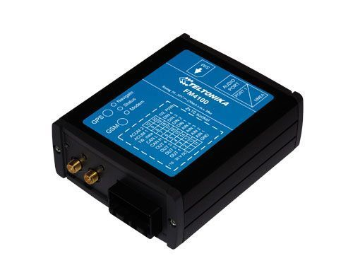

# Teltonika - FM 4100

The Teltonika FM 4100 is a compact and versatile GPS tracker with GSM connectivity designed for remote object location acquisition. It is built for tracking trucks, cars, and other moving assets, providing position fixes via GPS and delivering those coordinates over the GSM network. The unit is housed in a robust aluminum case and includes multiple inputs and outputs to monitor and control connected devices on the tracked object.

As a Plaspy compatible device, the FM 4100 can supply location and event data into the Plaspy fleet management platform for real time visibility and operational oversight. Its combination of GPS and GSM connectivity, multiple digital and analog I O channels, 1 Wire I O capability, and CAN bus and NMEA outputs make it a flexible option for organizations that want to consolidate tracking, sensor monitoring, and basic remote control within Plaspy.

## Key Highlights

- GPS and GSM connectivity for continuous location reporting and communication
- Support for GPRS class 10 and SMS bearers for data transfer and messaging
- Quad band operation for broad regional compatibility across major mobile networks
- Rugged aluminum enclosure suited to vehicle and industrial installations
- Multiple inputs and outputs including digital and analog channels for telemetry and control
- Additional interfaces such as 1 Wire I O, CAN bus, and NMEA output for expanded data sources

## How It Works with Plaspy

When connected to Plaspy, the FM 4100 transmits position updates and input output events over the cellular network so Plaspy can display locations, trigger alerts, and compile historical records. Plaspy ingests the tracker data and presents it in maps, event streams, and reports to support fleet monitoring and operational decision making.

- Live location and movement visibility on Plaspy maps and dashboards
- Event and alarm generation from digital input changes or thresholded analog values
- Monitoring of vehicle or asset telemetry collected via CAN bus and 1 Wire sensors
- Remote control of outputs initiated from Plaspy when supported by device configuration
- Fleet level reporting and history for route analysis and compliance tracking

## Typical Use Cases

- Fleet vehicle tracking for logistics and delivery operations
- Truck and trailer monitoring including door and load status
- Remote equipment oversight for construction and field service fleets
- Temperature or identification monitoring using 1 Wire sensors for sensitive cargo
- Route history and utilization reporting to improve operational efficiency

## Why Choose This Tracker with Plaspy

The FM 4100 is a practical choice when you need a balance of dependable positioning and flexible I O capabilities in a durable package. Its support for common data bearers and multiple interfaces makes it suitable for mixed fleets where both location and auxiliary telemetry matter. Paired with Plaspy, the device can contribute to a single platform view of vehicles, sensors, and events without requiring excessive custom integration work.

If your use case requires robust location reporting combined with simple remote monitoring and control, the FM 4100 is a relevant option to evaluate alongside Plaspy. For additional details and to confirm the device meets your exact technical and operational needs, learn more about Plaspy on the main website https://www.plaspy.com and verify current specifications and manufacturer documentation at the official Teltonika site https://www.teltonika-gps.com/ .
