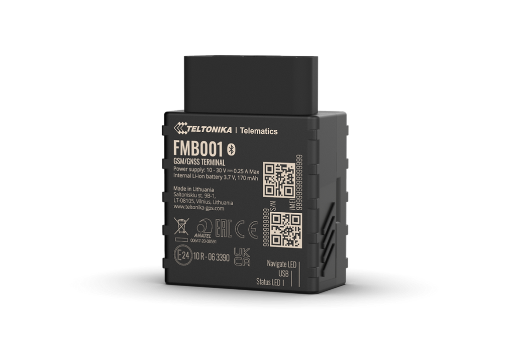

# Teltonika - FMB001

The Teltonika FMB001 is a compact GPS tracker designed for quick plug and play installation via a vehicle OBDII port. Built for fleet and personal vehicle monitoring, the device delivers vehicle-sourced telemetry such as true odometer, fuel level, mileage and engine RPM while also providing GNSS location for real time tracking. Bluetooth LE support extends monitoring to external sensors and beacons for temperature, humidity, magnet detection and movement.

As a Plaspy compatible tracker, the FMB001 forwards location, OBDII telemetry and Bluetooth sensor data into Plaspy for unified visibility and operational oversight. This integration makes the FMB001 relevant for fleet managers and operators who want straightforward device deployment together with real time tracking, alerts, and basic maintenance workflows inside the Plaspy platform.

## Key Highlights

- Plaspy compatible plug and play OBDII installation for fast deployment across fleets or single vehicles
- Reads vehicle telemetry including true odometer, fuel level, mileage and engine RPM for improved reporting
- Bluetooth LE support for external sensors and beacons to add temperature humidity magnet detection and movement monitoring
- Remote device management support via Teltonika FOTA WEB and Teltonika Configurator for group provisioning and updates
- Compact OBDII form factor reduces installation complexity and minimizes fleet downtime
- Available in bulk and single unit packaging with accessory options for common deployment needs

## How It Works with Plaspy

When connected to a vehicle, the FMB001 collects GNSS location and vehicle telemetry from the OBDII interface and forwards those data streams to Plaspy. Bluetooth LE sensor readings are included alongside vehicle parameters so location, environmental data and vehicle state are available in a single platform for monitoring and reporting.

- Real time location updates and telemetry delivered to Plaspy for live tracking and route oversight
- OBDII sourced parameters such as odometer fuel level mileage and RPM available for analytics and maintenance planning in Plaspy
- Bluetooth sensor data for temperature humidity magnet detection and movement reported to Plaspy to extend asset condition monitoring
- Remote configuration and firmware management through supported Teltonika tools combined with Plaspy device management workflows
- Use telemetry in Plaspy to drive alerts geofence rules and operational reporting for better fleet governance

## Typical Use Cases

- Fleet management and maintenance scheduling using odometer and RPM data to inform service intervals
- Logistics and delivery tracking with real time GPS and environmental sensor reporting for cargo condition visibility
- Anti theft and dealer inventory monitoring with quick OBDII installation and movement or magnet detection via BLE beacons
- Personal vehicle monitoring for trip history location and basic fuel usage insight
- Cold chain or sensitive asset monitoring by pairing external temperature and humidity beacons with location tracking

## Why Choose This Tracker with Plaspy

The Teltonika FMB001 is a practical option when you need a Plaspy compatible tracker that combines vehicle telemetry with environmental sensing in a plug and play form factor. Its ability to provide authentic odometer and engine data alongside Bluetooth sensor inputs makes it useful for a range of fleet and asset monitoring scenarios without complex wiring.

If you want to learn more about how Plaspy can use devices like the FMB001 for fleet tracking reporting and alerts visit https://www.plaspy.com. Product specifications availability and manufacturer details can change over time; verify current information and any End of Life status with the official manufacturer documentation at https://www.teltonika-gps.com/ before procurement.
