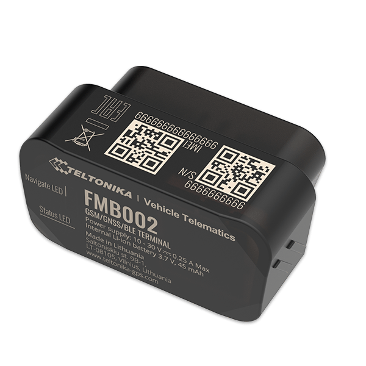

# Teltonika - FMB002

The Teltonika FMB002 is an ultra-small OBDII plug and play device that offers a wide range of features and connectivity options. With GNSS, GSM, BLE 4.0 connectivity, and CAN bus data reading capability, this tracker is perfect for various use cases, including fleet management of light commercial vehicles, driver log-book, insurance telematics \(UBI\), car rental, and leasing.

One of the standout features of the FMB002 is its OBDII standard data reading from a vehicle's on-board computer. This allows for effortless and low-cost integration, making it an easy and powerful solution. Additionally, the device supports various Bluetooth Low Energy sensors, beacons, hands-free headsets, and allows for firmware and configuration updates via Bluetooth.

The FMB002 offers a range of features that enhance its functionality and usability. It includes an accelerometer for sensor-based detection, allowing for scenarios such as green driving, over speeding detection, jamming detection, GNSS fuel counter, excessive idling detection, unplug detection, towing detection, crash detection, auto geofence, manual geofence, and trip tracking. The device also offers different sleep modes to optimize power consumption, including GPS sleep, online deep sleep, deep sleep, and ultra-deep sleep.

Configuration and firmware updates can be easily done through various methods, including FOTA web, FOTA, Teltonika Configurator \(USB, Bluetooth\), and the FMBT mobile application. The device also supports SMS commands for configuration, events, and debugging, as well as GPRS commands for configuration and debugging. Time synchronization can be achieved through GPS, NITZ, or NTP, ensuring accurate timekeeping.

With fuel monitoring capabilities through OBD II and ignition detection using the accelerometer, external power voltage, and engine RPM, the FMB002 provides comprehensive tracking and monitoring of vehicles. Its compact size and plug and play design make it easy to install and use, while its wide range of features make it a versatile solution for various tracking and management needs.

