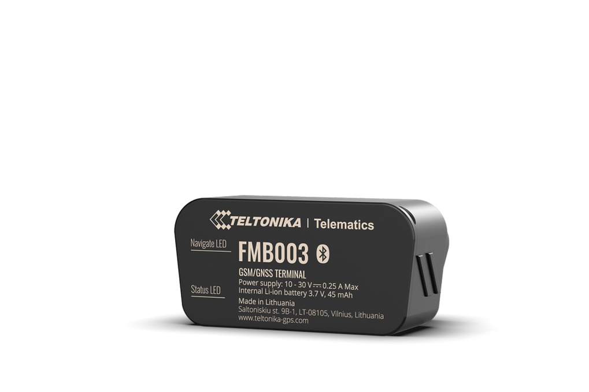

# Teltonika - FMB003

The Teltonika FMB003 is an ultra compact OBD II GPS tracker designed for plug and play installation in passenger cars. It is built to read OEM vehicle parameters from the OBD port and deliver discreet, OEM grade telemetry such as accurate odometer and fuel or battery metrics suitable for fleet management and vehicle monitoring.

As a Plaspy compatible device, the FMB003 forwards OEM level telemetry into Plaspy so fleet managers and operators can use reliable mileage and fuel battery readings as part of their tracking, reporting, and operational workflows. Its small form factor and straightforward deployment make it a practical option for rental fleets, car sharing, delivery vehicles, and EV programs that use Plaspy for centralized fleet oversight.

## Key Highlights

- Plug and play OBD II form factor for fast deployment across passenger vehicles.
- Access to OEM parameters for accurate odometer and real fuel or battery metrics.
- Ultra compact 29.1 mm wide casing for discreet installation in cars.
- Quad band 2G connectivity with coverage on B2 B3 B5 and B8 for broad cellular availability.
- Suited to rental, car sharing, logistics, delivery services, and EV monitoring.
- Simple integration with fleet platforms and remote device management via Teltonika tools.
- Available in standard and custom packaging options to support rollouts.

## How It Works with Plaspy

When connected to Plaspy, the FMB003 supplies OEM vehicle data and position information that Plaspy ingests for real time tracking, alerts, reporting, and automation. Plaspy uses those inputs to improve operational visibility and support workflows that depend on precise mileage and fuel battery measurements.

- Real time location and telemetry appear on Plaspy maps and dashboards for live monitoring.
- Accurate odometer readings and fuel or battery level data feed into reports and logs for compliance and billing.
- Vehicle status and ignition related OEM readings can be used to drive Plaspy automations and alerts.
- Data from the tracker can trigger fleet alarms, anti theft notifications, and operational responses in Plaspy.
- Remote provisioning and device management through Teltonika tools simplify large scale deployments that connect into Plaspy.

## Typical Use Cases

- Fleet management and logistics requiring precise mileage records for routing and reporting.
- Rental and car sharing fleets needing discreet telemetry for odometer verification and usage billing.
- Delivery services that require quick plug and play deployment across passenger vehicles.
- Electric vehicle programs that benefit from OEM battery metrics and extended vehicle coverage.
- Service scheduling and preventative maintenance driven by reliable mileage information.

## Why Choose This Tracker with Plaspy

The FMB003 is a compact, OEM data focused tracker that reduces installation complexity while providing the kind of mileage and fuel or battery telemetry fleet operators rely on. For organizations that prioritize accurate odometer and fuel battery information, the combination of an OBD II device like the FMB003 and Plaspy's fleet management capabilities helps remove uncertainty from mileage logs and fuel monitoring.

If you want to learn more about how Plaspy works with devices such as the Teltonika FMB003, visit https://www.plaspy.com to explore platform features and fleet solutions. Product specifications and availability can change over time, so please verify current details and supported features on the manufacturer's official site https://www.teltonika-gps.com/.
