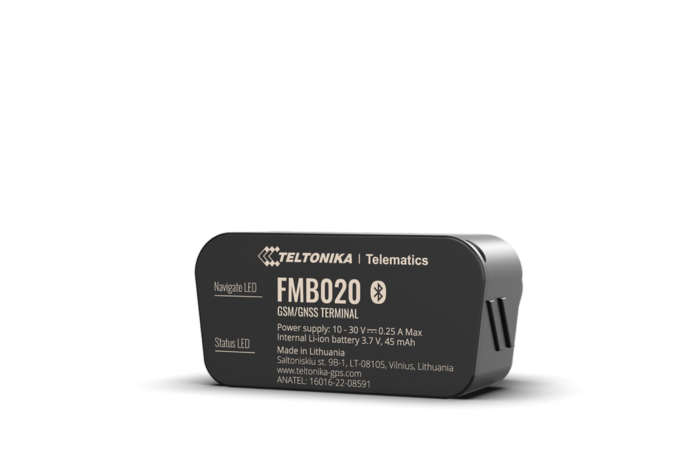

# Teltonika - FMB020

The Teltonika FMB020 is an ultra small GPS tracker designed for quick plug and play installation in passenger cars and light commercial vehicles. Its compact OBD II form factor makes it suitable for large scale rollouts where minimal downtime and discreet fitment are priorities. The device supports GPS location and expands with Bluetooth Low Energy sensors and beacons for contextual inputs such as temperature, humidity, magnet detection and movement monitoring.

As a Plaspy compatible unit, the FMB020 delivers immediate real time location and vehicle parameter data into Plaspy dashboards and workflows. With OBD II connectivity, BLE sensor support and vendor remote management options, the tracker can be integrated into Plaspy for live maps, alerts, reporting and fleet level oversight, making it a practical choice for operations that need fast deployment and richer telemetry without complex hardware changes.

## Key Highlights

- Plug and play OBD II form factor for fast installation and fleet rollout.
- Ultra compact design for discreet placement and minimal intrusion in vehicles.
- Bluetooth Low Energy support for optional external sensors and beacons to extend telemetry.
- Eco driving support to enable fuel monitoring and driver behaviour analysis when used with Plaspy.
- Remote management compatibility for configuration and updates to support large deployments.
- Well suited to high volume deployments where quick provisioning reduces operational overhead.

## How It Works with Plaspy

When connected in vehicle, the FMB020 streams GPS position, OBD derived parameters and BLE sensor inputs to Plaspy so teams can monitor vehicles and assets in real time. Plaspy uses that incoming data to power live maps, history, geofencing and automated notifications, enabling operators to act on location and telemetry events quickly.

- Real time location updates feed Plaspy maps, route replay and historical views.
- Vehicle parameter readings inform ignition state and event rules within Plaspy.
- Eco driving data and fuel related inputs can be used for driver scoring and efficiency reports.
- BLE sensor events provide environmental and movement context for alerts and asset awareness.
- Remote provisioning and updates help keep a Plaspy connected fleet consistent and manageable.

## Typical Use Cases

- Fleet management and logistics with rapid OBD II deployment across mixed passenger and light commercial vehicles.
- Car sharing and rental fleets that require quick installation and driver behaviour monitoring.
- Delivery services needing discreet tracking plus optional environmental sensors for sensitive cargo.
- Anti theft and security workflows combining GPS tracking and BLE magnet or movement sensors.
- Operations seeking scalable telemetry for fuel monitoring and performance reporting.

## Why Choose This Tracker with Plaspy

The FMB020 is a pragmatic option for organizations that prioritize fast installation, discreet hardware and the ability to extend functionality with sensors. Its OBD II plug and play approach reduces installation time, while BLE expansion and remote management capabilities allow fleets to scale monitoring and keep devices up to date. Plaspy ingests location, vehicle parameters and sensor data to provide the visibility and reporting needed for operational oversight.

If your deployment needs rapid rollout, basic vehicle telemetry and optional sensor integrations, the FMB020 is a compact, cost effective device to evaluate alongside Plaspy. Learn more about Plaspy on the main website https://www.plaspy.com and verify current product specifications and availability on the manufacturer site https://www.teltonika-gps.com/ as details and packaging may change over time.
