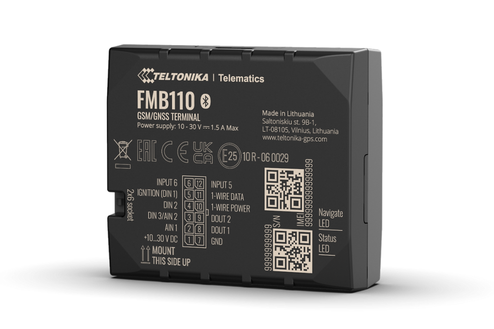

# Teltonika - FMB110

The Teltonika FMB110 is a compact 2G GPS tracker designed for reliable vehicle tracking and basic telematics. It includes internal cellular and GNSS antennas and supports common GSM bands, with integrated interfaces for temperature probes and iButton or RFID identification. The device is positioned for straightforward vehicle installations where compact size and core telemetry are required.

As a Plaspy compatible device, the FMB110 can feed position data, sensor readings, and status information into Plaspy dashboards and reporting tools. That compatibility makes the unit suitable for fleet management, logistics, cold chain monitoring, and car sharing scenarios where Plaspy provides visibility, alerts, and historical analysis for operational oversight.

## Key Highlights

- Plaspy compatible GPS tracker offering dependable real time tracking over 2G cellular networks.
- Compact design with internal cellular and GNSS antennas for discreet vehicle installation.
- 1 Wire interface for DS18B20 temperature probes and iButton or RFID tag reading for driver or asset identification.
- Bluetooth Low Energy support to connect external beacons and wireless sensors for environmental and movement monitoring.
- Remote engine blocking immobilizer capability to support anti theft and access control workflows.
- Standard packaging and SKU options to simplify procurement and scaled deployments.

## How It Works with Plaspy

When integrated with Plaspy, the FMB110 functions as a compact telemetry endpoint that transmits location, sensor and status data to the Plaspy platform for visualization, alerts and reporting. Plaspy consumes those streams to provide continuous visibility and operational controls across a fleet.

- Real time location and telemetry updates shown on Plaspy maps and dashboards.
- Alerts and notifications based on temperature thresholds, movement events, or tag readings.
- Remote immobilizer actions and ignition status surfaced in Plaspy for anti theft and fleet control.
- Historical reports and exportable logs for temperature, location history, and device activity.
- BLE sensor and beacon data aggregated into Plaspy for environmental monitoring and tamper detection.

## Typical Use Cases

- Fleet anti theft and immobilization where remote blocking and live location support rapid response.
- Cold chain logistics using DS18B20 probes for temperature logging and compliance reporting.
- Car sharing and access control with iButton or RFID based driver identification and activity tracking.
- Trailer and cargo monitoring with BLE beacons for humidity, vibration, or magnetic tamper detection.
- Basic driver behavior and operational monitoring to support maintenance and efficiency programs.

## Why Choose This Tracker with Plaspy

The Teltonika FMB110 provides a focused set of telematics features in a small form factor, making it a practical option for fleets and asset managers who need reliable position reporting, temperature sensing, and basic anti theft controls. Its compatibility with Plaspy allows teams to centralize tracking data, alerts, and historical reports without adding unnecessary complexity.

If you want to learn more about how Plaspy can work with the Teltonika FMB110, visit https://www.plaspy.com. Product specifications, availability, and manufacturer support can change over time, so please verify current details and firmware information on the Teltonika official site https://www.teltonika-gps.com/ before large scale deployments.
