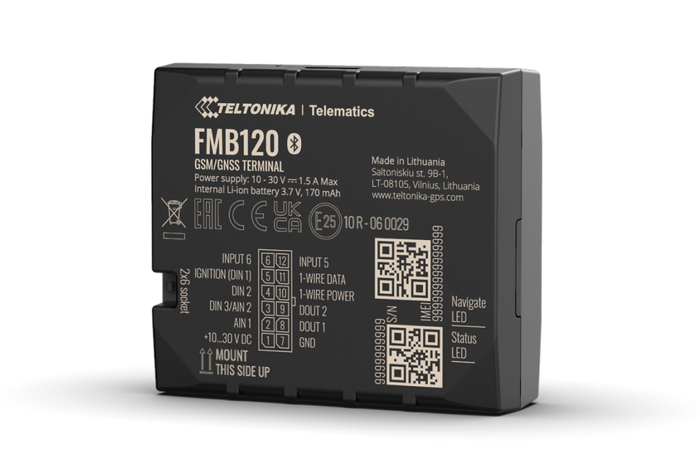

# Teltonika - FMB120

The FMB120 is a compact, Plaspy compatible GPS tracker built for cost-sensitive vehicle telematics and remote fleet monitoring. Designed primarily for 2G GSM networks, the FMB120 delivers continuous location tracking, essential status monitoring and supports remote fleet control measures such as engine immobilization. Its small form factor and flexible packaging options make it a practical choice for rental cars, taxis, logistics vehicles, public transport and personal vehicles that need dependable, low-cost tracking and basic telemetry.

When integrated with Plaspy, the FMB120 becomes a straightforward building block for real-time tracking, anti-theft workflows and sensor-driven telemetry. The device supports Bluetooth LE for external beacons and sensors, a 1-Wire port for temperature probes and RFID/iButton reader connectivity, enabling extended monitoring such as temperature-controlled cargo, magnet detection and movement alerts. Plaspy-compatible integration enables live location updates, event alerts and remote immobilizer control for efficient fleet management.

## Key Highlights

- Plaspy compatible GPS tracker for continuous location tracking and mapping in real-time.
- 2G GSM connectivity \(bands B2, B3, B5, B8\) for economical deployment where 2G remains available.
- Remote immobilizer support to enable anti-theft workflows and remote engine disablement.
- Bluetooth LE support for external sensors and ID beacons — temperature, humidity, magnet and movement monitoring.
- Onboard 1-Wire port for direct temperature sensor integration and RFID/iButton reader support for driver/asset ID.
- Standard digital I/O for ignition and vehicle event monitoring and integration with telematics workflows.
- Multiple SKUs and packaging choices \(internal battery options and Micro-USB accessories\) for flexible procurement and deployment.

## How It Works with Plaspy

The FMB120 connects to Plaspy over the device’s cellular link to deliver location and event data to the Plaspy platform. Once onboarded, the tracker transmits position updates and status telemetry to Plaspy where they appear in dashboards, live maps and automated reports. Plaspy processes I/O events and Bluetooth sensor data from the device so you can set geofences, receive immobillization commands and trigger alerts for temperature excursions or unauthorized movement.

- Real-time location and telemetry updates pushed to Plaspy for live tracking and historical playback.
- Ignition and vehicle event status reported through the device’s digital I/O for trip logging and driver behavior rules.
- Fuel monitoring workflows supported when paired with external sensors or integrations \(requires appropriate sensors or vehicle interfaces\).
- Remote immobilizer control — Plaspy can send immobilization commands for anti-theft response and remote fleet control.
- Bluetooth sensors and beacons \(BLE\) supported for temperature, humidity, magnet and movement monitoring using compatible peripherals.

## Technical Overview

| Connectivity | 2G GSM \(cellular data for telemetry and commands\) |
| --- | --- |
| Bands | B2 / B3 / B5 / B8 \(2G GSM frequency support\) |
| Power & Battery | Available with or without internal battery depending on SKU; Micro-USB cable options available in some packs |
| Interfaces | 1-Wire port for temperature sensors, RFID/iButton reader support, standard digital I/O for vehicle events and immobilizer control |
| GNSS | Satellite-based location tracking for continuous position updates and route history |
| Bluetooth | Bluetooth Low Energy \(BLE\) for external beacons and sensor peripherals \(temperature, humidity, magnet, movement\) |
| Remote Management | Documentation, firmware and driver downloads available; knowledge base and support resources for installation and configuration |
| Form Factor | Compact car tracker — designed for vehicle installation; multiple commercial packaging configurations \(bulk options available\) |

## Use Cases

- Fleet anti-theft and immobilization — remotely disable vehicles and receive theft alerts via Plaspy when unauthorized movement is detected.
- Temperature-monitored cargo transport — pair BLE or 1-Wire temperature sensors for refrigerated or sensitive shipments and monitor conditions through Plaspy.
- Rental, taxi and carshare tracking — driver identification via RFID/iButton, trip logging and real-time location for operational oversight.
- Basic fleet management for small to mid-sized fleets — GPS tracking, telematics events and asset assignment without high-cost cellular plans.
- Asset and door/alarm event monitoring — trigger alerts from standard I/O inputs or magnet sensors to detect door openings or tamper events.

## Why Choose This Tracker with Plaspy

Pairing the FMB120 with Plaspy delivers a pragmatic, cost-effective telematics solution for operators who need dependable real-time tracking and essential fleet control without complex hardware requirements. The device’s 2G connectivity keeps ongoing costs low in regions where 2G is available, while Bluetooth LE and 1-Wire support let you extend telemetry to temperature, humidity and presence sensors. With remote immobilizer capability and standard I/O for ignition and vehicle events, the FMB120 supports anti-theft workflows and basic vehicle monitoring out of the box.

Operational teams benefit from multiple SKUs and packaging options, accessible firmware and driver downloads, and a knowledge base that simplifies rollout and maintenance. When integrated with Plaspy, the FMB120 enables live tracking, alerts, and simple remote management — delivering the reliability and telemetry needed for rental fleets, logistics, taxi services and temperature-sensitive cargo operations.

