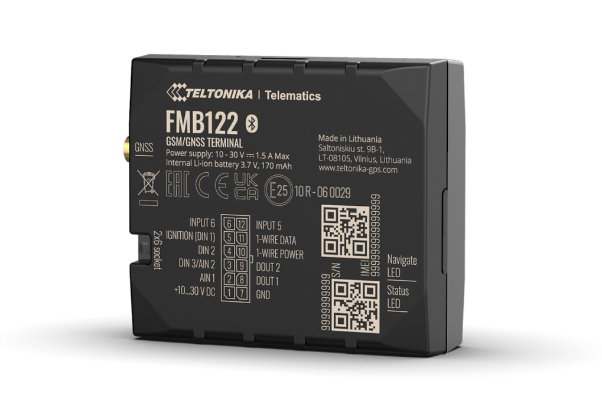

# Teltonika - FMB122

The Teltonika FMB122 is a compact 2G GPS tracker engineered for fleet management and anti-theft vehicle security. Designed to integrate smoothly with Plaspy, the FMB122 brings dependable real-time tracking and telemetry to deployments that need dual-SIM resilience, Bluetooth Low Energy sensor support, and 1-Wire identification. For fleets, service vehicles, and high-value assets, this Plaspy compatible GPS tracker delivers concise location data and sensor inputs that help operators react faster and manage risk.

The FMB122 remains a practical choice where straightforward, reliable GSM connectivity is acceptable. With dual SIM operation to reduce roaming costs and an external GNSS antenna option to improve satellite reception in difficult installations, the device supports telemetry workflows, BLE sensors and RFID/iButton identification. Even if the product page marks End-of-Life, the FMB122’s core features continue to support anti-theft workflows and fleet telematics integration with Plaspy for ongoing operational use.

## Key Highlights

- Plaspy compatible GPS tracker for real-time tracking and fleet management telemetry.
- 2G \(GSM\) connectivity with dual SIM support to reduce roaming and improve uptime.
- Bluetooth Low Energy \(BLE\) for integration with beacons and external Bluetooth sensors.
- 1-Wire interface supporting RFID/iButton driver identification and temperature sensors.
- Optional external GNSS antenna for better satellite reception in challenging mounts.
- Compact, vehicle-focused form factor with accessory ecosystem \(CAN adapters, antennas, cables\).
- Works with Teltonika device management tools such as FOTA WEB and configurator utilities for updates and configuration.

## How It Works with Plaspy

When connected to Plaspy, the FMB122 delivers location and sensor telemetry to the platform using its 2G cellular link. Plaspy ingests GNSS position data, BLE sensor readings, and 1-Wire inputs \(RFID/iButton IDs and compatible temperature sensors\) to provide real-time tracking, geofencing, and alerting. Dual SIM increases connection reliability, and Plaspy’s dashboard and alerting can be used to translate raw device signals into operational actions for fleet management and anti-theft response.

- Real-time location and telemetry updates sent from the FMB122 to Plaspy via 2G connectivity.
- Driver or asset identification using RFID/iButton over the 1-Wire interface, reported to Plaspy for driver logs.
- Temperature monitoring from 1-Wire sensors and environmental BLE sensors when used for cold-chain or asset condition tracking.
- Bluetooth sensors and beacons \(BLE\) for door, movement, magnet detection, or proximity events integrated into Plaspy rules.
- Dual SIM cellular failover to maintain telemetry streams and alerts in roaming or weak-coverage scenarios.

## Technical Overview

| Connectivity | 2G GSM \(cellular telemetry\); dual SIM support |
| --- | --- |
| Bands | B2, B3, B5, B8 \(2G GSM\) |
| Power & Battery | Vehicle-powered device; supplied with power cables \(typical 0.9 m\); no internal battery specified |
| Interfaces | 1-Wire interface \(RFID/iButton, 1-Wire temperature sensors\); Micro USB present in some variants; compatible with CAN adapters and supplied I/O cables |
| GNSS | GNSS receiver with optional external GNSS antenna for improved satellite reception \(external antenna kits available\) |
| Bluetooth | Bluetooth Low Energy \(BLE\) for beacons and wireless sensors \(temperature, humidity, magnet, movement\) |
| Remote Management | Supports Teltonika tools such as FOTA WEB and configurator utilities for device configuration and firmware updates |
| Form Factor | Compact vehicle tracker intended for fleet telematics and anti-theft installations; variants supplied with GNSS antenna, Micro USB cable and power cables |

## Use Cases

- Fleet management — real-time GPS tracking, driver identification, and telemetry reporting to Plaspy for dispatch and route oversight.
- Anti-theft monitoring — continuous location reporting and BLE/1-Wire accessory alerts to detect unauthorized movement or tampering.
- Cold-chain and asset condition monitoring — 1-Wire temperature sensors and BLE environmental sensors feed Plaspy for temperature alerts and compliance logs.
- Fuel and ignition data \(via CAN adapter\) — when paired with a CAN adapter, the FMB122 can supply vehicle bus data to Plaspy for fuel monitoring and ignition status analysis.
- Driver identity and access control — RFID/iButton identification for driver logs, access events and accountability reporting in Plaspy.

## Why Choose This Tracker with Plaspy

Choosing the Teltonika FMB122 as a Plaspy compatible GPS tracker gives teams a compact, proven platform for real-time tracking and telemetry. The device’s dual SIM architecture reduces roaming cost exposure and improves connectivity reliability, while BLE and 1-Wire support extend its utility beyond basic GPS positioning to include driver ID, temperature sensing and proximity-based workflows. Integration with Teltonika management tools \(FOTA WEB and configurator\) simplifies updates and provisioning, and Plaspy’s dashboard converts the FMB122’s signals into actionable alerts, reports and fleet-management insights. For operations where reliable GSM coverage, sensor support and anti-theft workflows are required, the FMB122 remains a practical, integration-friendly option.

