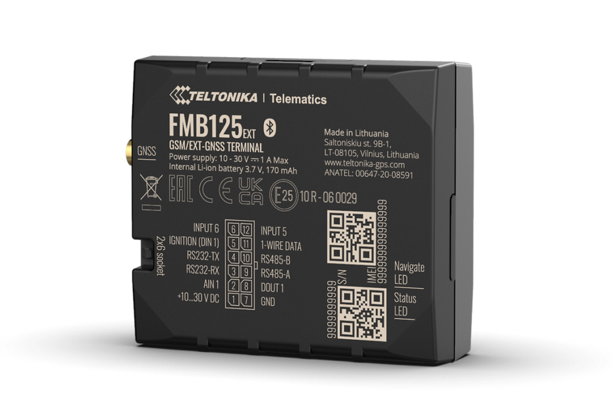

# Teltonika - FMB125

# FMB125

The FMB125 is a compact, professional GPS tracker from Teltonika designed for fleet management and advanced telemetry. Plaspy compatible out of the box, the FMB125 delivers reliable real-time tracking and flexible integration options — from RFID-based driver identification to serial sensor telemetry — making it well suited for logistics, service fleets, and asset management where consistent location and usage data are essential.

The device combines dual‑SIM 2G cellular connectivity with RS232/RS485 serial interfaces, impulse input for fuel meters, onboard RFID and 1‑wire support. For operations that require global reach beyond cellular networks, the FMB125 can work with an Iridium Edge® satellite modem via the RS232 port. Please note the FMB125 is listed as End of Life \(EOL\); newer 4G/LTE-M replacements \(FMC125, FMM125\) are recommended for new long-term deployments.

## Key Highlights

- Plaspy compatible: seamless ingestion of GNSS location and telemetry for real-time tracking and reporting.
- Dual‑SIM 2G cellular for resilient connectivity and reduced roaming costs in supported regions.
- RS232 and RS485 serial interfaces enable third‑party device integration and advanced telemetry collection.
- Impulse input support for accurate fuel monitoring from flow meters and pulse sensors.
- Onboard RFID and 1‑wire support for quick driver or asset identification workflows.
- Satellite fallback option via Iridium Edge® through RS232 for coverage beyond terrestrial networks.
- Compact, vehicle‑oriented form factor with packaged GNSS antenna and power cable options for easy installation.

## How It Works with Plaspy

When paired with Plaspy, the FMB125 streams GNSS position data and telemetry over cellular or satellite links into Plaspy’s platform for real-time tracking, alerts, and historical reporting. Plaspy can consume serial sensor data and pulse inputs delivered by the FMB125, enabling fleet managers to combine location with operational metrics such as fuel usage and driver identification events.

- Real-time location and telemetry updates to Plaspy for live mapping and geofencing alerts.
- Impulse input data \(fuel flow meters\) transmitted as telemetry for fuel monitoring and reporting.
- RS232/RS485 serial sensor integration: temperature, CAN gateways, and other third‑party devices \(data forwarded to Plaspy\).
- RFID and 1‑wire events for driver/asset identification and access logging in Plaspy workflows.
- Satellite fallback via Iridium Edge® \(connected over RS232\) to extend tracking coverage where cellular is unavailable.
- Remote configuration and firmware management using Teltonika FOTA WEB and Configurator, with settings and updates coordinated with Plaspy integration procedures.

## Technical Overview

| Connectivity | 2G cellular \(dual‑SIM\). Optional satellite connectivity via Iridium Edge® modem through RS232. |
| --- | --- |
| Bands | 2G \(GSM\) — specific frequency bands depend on product variant/region. |
| Power & Battery | Vehicle‑powered. Ships with power cable in typical packages; no internal backup battery specified in product documentation. |
| Interfaces | RS232, RS485 serial ports; impulse input for fuel meters; 1‑wire; onboard RFID reader. |
| GNSS | GNSS receiver \(GPS\); external GNSS antenna supplied with some packages. |
| Bluetooth | Not specified for this model. |
| Remote Management | Teltonika FOTA WEB and Teltonika Configurator for firmware updates and configuration. Support resources available on Teltonika's wiki. |
| Form Factor | Compact vehicle tracker designed for installation in cars, vans, and trucks. |

## Use Cases

- Fleet management: real‑time vehicle tracking, route optimization, and operational telemetry reporting through Plaspy.
- Fuel monitoring: connect pulse fuel flow meters to the impulse input to report consumption and detect anomalies.
- Driver identification and access control: RFID and 1‑wire support for logging driver events and linking trips to personnel records.
- Advanced telemetry: RS232/RS485 enables integration with CAN adapters, temperature sensors, or other third‑party telemetry devices for comprehensive vehicle data.
- Remote asset tracking beyond cellular networks using Iridium Edge® satellite modem integration where continuous coverage is required.

## Why Choose This Tracker with Plaspy

The FMB125 provides a compact, integration‑friendly option for fleets that need dependable real‑time tracking, telemetry and fuel monitoring combined with the flexibility of serial connectivity. Its dual‑SIM design helps maintain cellular uptime, while RS232/RS485 and RFID support let you bring a wide range of vehicle and sensor data into Plaspy for richer analytics and operational control. For operations requiring truly global reach, the FMB125’s ability to interface with an Iridium Edge® satellite modem delivers a practical path to expanding coverage.

Although the FMB125 is now EOL, its proven feature set and compatibility with Plaspy make it a solid choice for existing deployments. For new projects or where 4G/LTE-M connectivity is preferred, consider Teltonika’s FMC125 \(4G\) or FMM125 \(LTE Cat M1/NB‑IoT\) family as updated alternatives that simplify long‑term network support and future scalability. In either case, integration and lifecycle management are streamlined through Teltonika’s FOTA WEB and Configurator tools, and Plaspy’s platform support for GPS tracker telemetry ensures a smooth deployment and ongoing operation.

