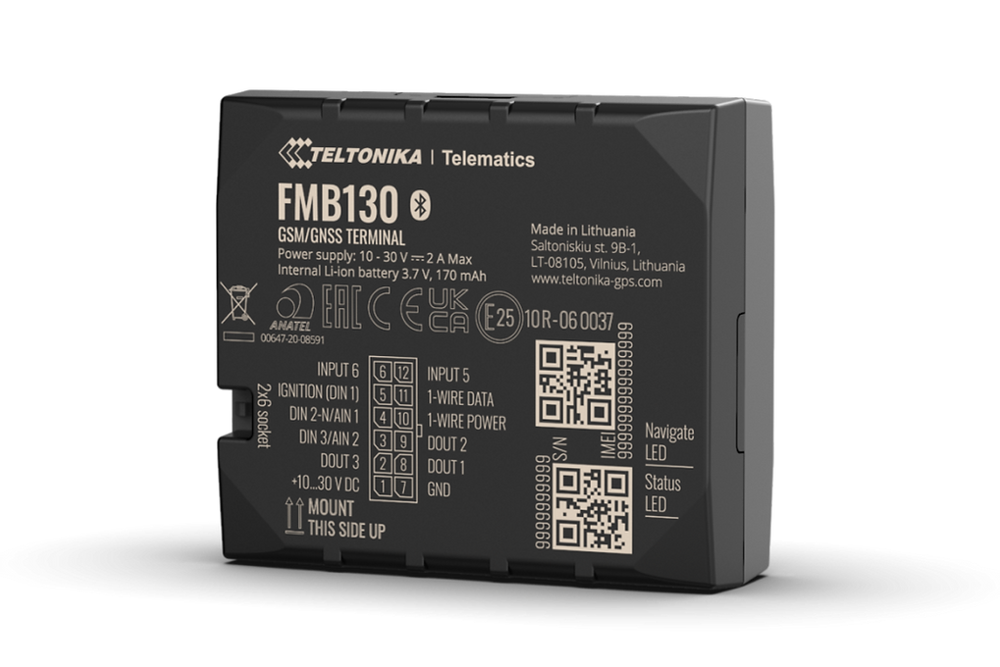

# Teltonika - FMB130

The Teltonika FMB130 is a compact vehicle grade GPS tracker designed for heavy fuel usage machinery, including construction equipment, agricultural machines and other special purpose vehicles. It provides position reporting alongside flexible inputs for impulse fuel meters, CAN adapter compatibility for vehicle parameters, and Bluetooth sensor support for environmental or asset sensing. The FMB130’s small form factor and vehicle focused features make it suitable for long term fleet deployment on off road and specialized equipment.

As a Plaspy compatible device, the FMB130 forwards GPS positions, CAN sourced vehicle parameters and Bluetooth sensor data into the Plaspy platform for unified visualization and management. Integrating this tracker with Plaspy enables fleets to combine location, fuel telemetry and sensor readings into dashboards, alerts and reports for operational oversight and anti theft workflows.

## Key Highlights

- Plaspy compatible GPS tracker for real time tracking and fleet management dashboards
- Fuel monitoring support via impulse inputs for flow meters and flexible sensor inputs
- CAN adapter compatibility to surface vehicle parameters such as fuel level and odometer into Plaspy
- Remote engine blocking immobilizer support for anti theft and fleet control scenarios
- Bluetooth Low Energy support for external sensors and beacons to extend monitoring capabilities
- Compact vehicle oriented design that simplifies deployment on construction and agricultural equipment

## How It Works with Plaspy

When connected to Plaspy, the FMB130 streams location and telemetry to the platform so operators can monitor assets in real time, receive event notifications and run historical reports. Plaspy ingests position updates together with CAN derived metrics and BLE sensor readings to present a single operational view across mixed fleets and equipment.

- Real time location and movement reporting for mapping, geofencing and live monitoring
- Fuel telemetry forwarding from impulse inputs to support consumption analysis and theft detection
- Vehicle parameter reporting via CAN adapter data for maintenance planning and operational KPIs
- Remote immobilizer actions available to authorized operators through Plaspy for security response
- BLE sensor integration for temperature, humidity or motion data to support cold chain and asset monitoring

## Typical Use Cases

- Fuel management for machinery fleets using impulse meter inputs and CAN sourced fuel level
- Tracking and anti theft protection for construction and agricultural equipment in remote locations
- Cold chain and environmental monitoring by pairing BLE temperature or humidity sensors
- Rental and shared equipment fleets that require odometer and operational telemetry for billing and maintenance
- Logistics and emergency transport where location and sensor telemetry support timely decision making

## Why Choose This Tracker with Plaspy

The FMB130 combines purpose built vehicle telematics with extensible sensor support that complements Plaspy’s fleet monitoring and reporting capabilities. Its emphasis on fuel monitoring, CAN telemetry and BLE sensors makes it a practical option for organizations that need unified tracking, condition monitoring and remote control features across mixed equipment types.

If you want to explore how the FMB130 can fit into your Plaspy deployment, learn more about Plaspy on the main website https://www.plaspy.com. Product specifications, availability and manufacturer details can change over time, so verify current technical information and ordering options with the official Teltonika documentation at https://www.teltonika-gps.com/ before finalizing procurement.
