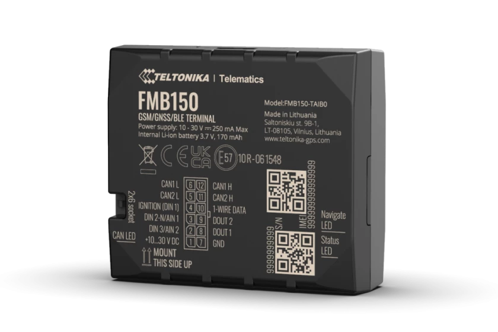

# Teltonika - FMB150

The Teltonika FMB150 is an advanced 2G GPS tracker with an integrated CAN data processor designed to read CAN bus data from light and electric vehicles, trucks, buses, and special machinery. It combines multi constellation GNSS positioning with a built in TM2500 communications module and Bluetooth LE capability, enabling a mix of location tracking and on vehicle data collection useful for fleet management and diagnostics.

As a device compatible with Plaspy, the FMB150 can feed location, vehicle CAN data, and external sensor inputs into the Plaspy platform for consolidated fleet visibility. Its support for electric vehicle CAN reading and Bluetooth LE connected beacons and sensors makes it a practical option when Plaspy users need both positional tracking and additional vehicle or asset telemetry in one device.

## Key Highlights

- Integrated CAN data processor for reading vehicle data and supporting basic diagnostics workflows.
- Bluetooth LE support for connecting external beacons and low energy sensors to extend monitoring capabilities.
- Multi constellation GNSS receiver with high sensitivity for improved location accuracy.
- Designed for a wide range of vehicles including light vehicles, trucks, buses, and electric vehicles.
- Rugged operating range and ingress protection suitable for demanding vehicle environments.
- Multiple input and output interfaces for flexible integration with vehicle systems and external devices.

## How It Works with Plaspy

The FMB150 transmits location and vehicle data that Plaspy can collect and present alongside other fleet information, enabling unified monitoring and reporting. Plaspy can ingest the device data stream to provide operational insight, alerting, and historical analysis for fleets that use this tracker.

- Real time vehicle location visibility and map tracking within Plaspy.
- Vehicle condition and operational insights derived from CAN data presented in dashboards and reports.
- Inputs from Bluetooth LE connected sensors such as temperature or movement beacons visible in Plaspy for extended asset monitoring.
- Alerting and notifications for events like ignition, movement, or custom thresholds configured in Plaspy.
- Historical trip logs and reporting for trip analysis, utilization, and compliance review.
- Centralized operational oversight for mixed fleets including combustion and electric vehicles.

## Typical Use Cases

- Fleet vehicle tracking and operational management for light and heavy vehicles.
- Electric vehicle monitoring with CAN data collection for EV specific parameters.
- Monitoring of buses, trucks, and special machinery where vehicle data and location are required.
- Asset condition monitoring using Bluetooth LE sensors for temperature, humidity, or movement detection.
- Security and movement detection for managed assets and to support dispatching workflows.

## Why Choose This Tracker with Plaspy

The FMB150 combines vehicle CAN data collection, multi constellation GNSS positioning, and Bluetooth LE extensibility to offer a balanced feature set for organizations that need both location and vehicle level insight. For fleets that include electric vehicles or require additional sensor inputs, the FMB150 provides a single device capable of expanding telemetry beyond basic GPS.

When paired with Plaspy, this compatibility enables operators to consolidate location, vehicle diagnostics, and sensor data into a single fleet management view. That makes it easier to monitor operational health, streamline reporting, and respond to events from a unified platform, while allowing customers to choose the device features that match their operational needs.

To learn more about Plaspy and how it can work with devices like the Teltonika FMB150 visit https://www.plaspy.com. Product specifications, availability, and manufacturer details can change over time, so please verify current technical documentation and compatibility on the manufacturer site https://www.teltonika-gps.com/.
