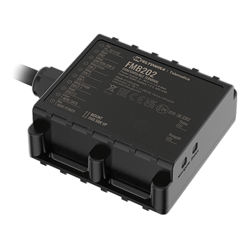

# Teltonika - FMB202

The Teltonika FMB202 is a special waterproof \(IP67\) GPS tracker that offers a range of features and capabilities. With its Bluetooth connectivity, internal high gain GNSS and GSM antennas, and integrated high capacity backup battery, this tracker is designed to work longer without a power supply. In fact, with its NiMH battery, the FMB202 can work up to 2 days in power saving mode. This makes it an ideal choice for various applications such as agriculture, delivery, refrigerated transport, trailers tracking, security & emergency services, and more.

One of the standout features of the FMB202 is its versatility. It can be powered by a 6-30V power supply, making it suitable for use with motorbikes and water transport. Additionally, it offers a range of sensors including an accelerometer, allowing for advanced functionality such as green driving, over speeding detection, jamming detection, and more. The FMB202 also supports various sleep modes, including GPS sleep, online deep sleep, deep sleep, and ultra deep sleep, ensuring efficient power usage.

Configuration and firmware updates are made easy with the FMB202, thanks to options such as FOTA Web, FOTA, Teltonika Configurator \(USB, Bluetooth\), and the FMBT mobile application. The tracker also supports SMS commands for configuration, events, DOUT control, and debugging, as well as GPRS commands for configuration, DOUT control, and debugging. Time synchronization is available through GPS, NITZ, and NTP, while fuel monitoring can be done using LLS \(Analog\) or an OBDII dongle. Ignition detection is supported through various inputs including digital input 1, accelerometer, external power voltage, and engine RPM \(OBDII dongle\).

With its robust features, waterproof design, and long-lasting battery, the Teltonika FMB202 is a reliable and versatile GPS tracker that can be used in a wide range of applications. Whether you need to track vehicles, monitor fuel consumption, or ensure the safety and security of your assets, the FMB202 is up to the task.

